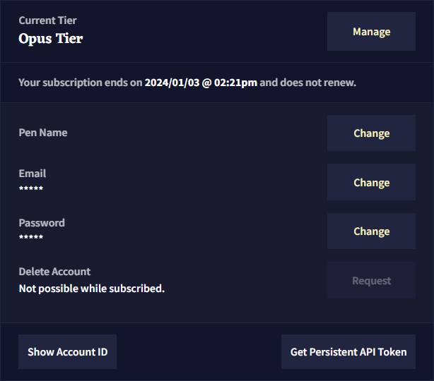
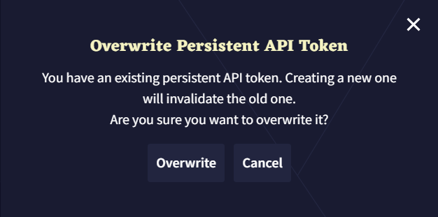
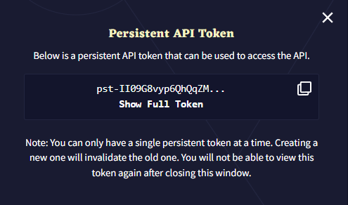
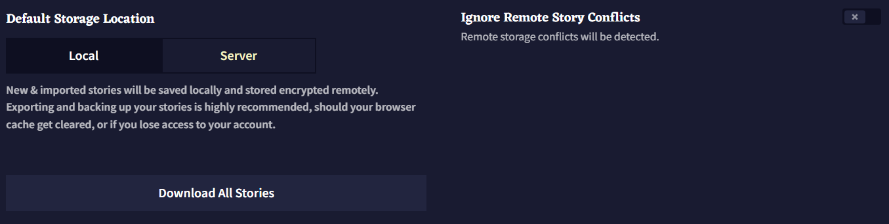
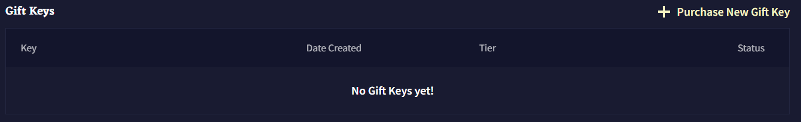

# Account
*Last contents updated 9/24/2024*

**Account** 탭은 사용자의 다양한 정보에 관한 설정, 구독 관리, 스토리에 관한 몇가지 중요한 옵션이 있습니다. 이 페이지에서 **Gift Keys**를 확인하거나 구입할 수 있습니다.

- Manage

**Manege** 버튼을 누르면 **Activate Gift Keys**와 구독 페이지를 통해 **Change your Subscription**할 수 있는 팝업 메뉴가 열립니다.

- Pen Name

사용자가 설정한 **Pen Name**은 [시나리오로 내보내는](./story_settings.md#export-story) 모든 스토리에 표시됩니다.

- Email

이메일 주소를 변경하려면 확인을 위해 현재 계정의 이메일과 암호가 필요합니다.

- Password

NovelAi의 암호를 바꾸기 위해서는 확인을 위해 현재 이메일 주소와 암호가 필요합니다.

>  **Goose tip:**
이메일이나 암호를 변경하기 전에 이야기들을 백업하세요! 변경하면 저장된 이야기가 삭제됩니다!

- Delete Account

NovelAI 계정을 삭제하면 NovelAI는 사용자에게 확인 이메일을 전송하며 사용하길 원하는 이메일 주소를 입력하라는 팝업이 표시됩니다.

- Show Account ID

**Show Account ID** 버튼을 클릭하면 사용자의 고유 계정 IP가 표시됩니다.

- Get Persistent API Token

**Get Persistent API Token** 버튼을 누르면 사용자는 NovelAI API를 사용할 수 있는 API token이 발급됩니다. 버튼을 처음 사용하는 사용자도 'Overwrite' 메시지가 나타날 수 있으므로 놀라지 마십시오.

**Overwrite** 버튼을 눌러 새로운 토큰을 생성하고 난 후, **Copy Icon**을 눌러 토큰을 클립보드로 복사하거나 **Show Full Token**를 클릭하여 풀토큰을 확인할 수 있습니다. 팝업창을 닫으면 **다시 토큰을 확인할 수 없으므로** 계속 진행하기 전에 안전한 곳에 보관하거나 필요한 곳에 복사하세요.

>  **Goose tip:**
새 **Persistent API Token**을 생성하면 기존의 API 토큰이 무효화됩니다. API 액세스 포인트나 이를 사용하는 다른 장소에서 Persistent API Token을 업데이트하는 것을 잊지마세요!

### Default Storage Location

**Default Storage Location** 토글은 새 이야기에 사용될 기본 설정을 결정합니다. **Server**로 유지하는 것이 권장됩니다.

### Ignore Remote Story Conflicts

**Ignore Remote Story Conflicts** 토글은 원격지와 로컬 버전의 스토리 사이에서 발견되는 충돌 팝업을 끌 수 있습니다.

### Download All Stories

모든 이야기를 다운로드하는 것은 어느정도 시간이 소요될 수 있습니다. 브라우저 다운로드 폴더에 `.zip` 파일로 표시됩니다.

### Gift Keys

구입한 모든 **Gift Keys**가 여기에 나타난다. **Purchase New Gift Key** 버튼을 사용하여 가능한 구독 티어의 키를 구입하세요.