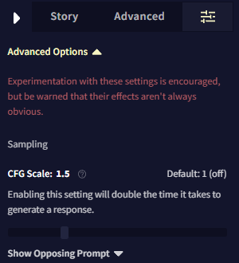
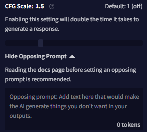

# Advanced: CFG

## Introduction

Sampling 슬라이더에 새롭게 추가된 것이 바로 CFG(Classifier Free Guidance)입니다! 이 흥미롭고 새로운 ***실험적*** 샘플링 방법은 출력을 이전보다 더 생생하고 주제에 맞게 만들어주지만 최고의 결과를 위해서는 주의해서 사용해야 합니다. 고급 사용자 여러분, 다음의 실험적인 시도를 할 준비가 되었나요?

## Mechanics

그렇다면 샘플링 순서에 CFG를 넣기로 결정했을 때, 내부에서는 어떤 일이 벌어질까요? 곧 모든 것에 대한 설명을 하겠지만, 간단히 말하면 CFG는 한 쌍의 숨겨진 출력을 생성합니다: 하나는 '반대'이고, 하나는 '중립' 입니다. 그런 다음 편집기에서 제공되는 세번쨰 및 마지막 출력을 유도하기 위해 그 둘의 차이를 계산합니다. CFG가 활성화 상태에서 출력이 **느리다는 느낌**을 받는다면 이러한 다중-패스 동작*multi-pass behavior*이 그 이유입니다.

조금 더 자세히 알아봅시다. **"Change Settings Order"** modal **(Options Sidebar -> Sliders Tab -> Sampling Section)**에서 CFG를 활성화하거나  CFG가 활성화된 프리셋을 불러오면 두가지의 요소가 있음을 알게 될 것입니다: **"CFG Scale: "** 라고 이름이 적힌 슬라이더와 **텍스트 박스**. 이 슬라이더와 텍스트 박스가 어떻게 같이 작동하는지 설명하기 위해 슬라이더를 중간 정도의 강도 값 —가령, 1.6—으로 설정하고 텍스트 박스를 비워둔 채 에디터에서 텍스트를 약간 생성해봅시다.

빠르게 요약하자면, CFG를 사용한 생성은 두개의 숨겨진 출력으로 시작하고 사용자가 받는 세번째 출력으로 진행됩니다. 실제로 이것은 한번에 동시에 이뤄지는 것이 아니라 토큰 별로 수행되기 때문에 CFG를 사용하는 중에도 여전히 스트리밍된 출력 결과를 얻을 수 있습니다! 따라서 각각의 토큰에 대해 모델은 먼저 CFG 텍스트 박스에 입력한 내용을 제외한, **컨텍스트 없이** 숨겨진 토큰 확률을 생성합니다. 이것이 *반대 출력*입니다. 그 후, 모델은 평소처럼 스토리의 모든 컨텍스트를 가지고 숨겨진 다른 토큰 확률을 생성합니다. 이것이 *중립 출력*입니다. CFG는 이 두 개의 출력을 가지고 두 출력의 잠재적인 토큰 선택의 차이점을 비교합니다.

그러므로 이 예제에서 모델은 일단 스토리가 비어있는 것처럼 출력을 생성합니다(비어있는 CFG 텍스트 박스를 가정했었습니다). 그 후 스토리와 컨텍스트에 대한 출력을 생성합니다. 이 두 출력에 차이점이 발견되고, 1.6의 배율로 조정된 다음, 에디터에서 나타나는 세번째의 '진짜' 출력을 선택하는데 사용됩니다. 이것이 *최종* 출력입니다. 이제 CFG 텍스트 박스에 대해 이야기해 보겠습니다.

>  **Goose tip:**
이것이 토큰 별로 동작된다는 것을 기억하세요. 그러므로 실제로 최종 출력에 대한 숨겨진 "역출력"이라는 것은 **존재하지 않으며**, 각 토큰에 대한 느슨한 확률들만 있어요.

## The CFG Text Box (Opposing Prompt)

CFG 텍스트 박스를 비워둔 것은 *의도된 사용 모드*라는 점을 유의해야 합니다. CFG 텍스트 박스를 비워둠으로써 CFG는 더 정확한 출력을 위해 AI의 기본 문체와 사용자의 이야기 스타일의 차이점을 강조하기 때문입니다. 하지만 박스가 있는 것은 이유가 있습니다. CFG 텍스트 박스에 내용을 입력하면 어떻게 될까요?

예를 들어, 박스에 다음과 같은 내용을 추가했다고 가정해봅시다: `I felt a sharp pain in my side. to the box.`

이번에는 *반대 출력*을 생성할 때, `Suddenly, I felt a sharp pain in my side.. `만 있는 스토리가 주어졌을 때 AI가 생성한 것과 동일한 응답이 될 것입니다. 그리고나서 이 응답은 *중립 출력*과 비교하여 가중치를 매기고 *최종 출력*을 위해 지난번처럼 CFG 스케일에 의해 확대됩니다. CFG 텍스트 박스에 올바른 입력을 하면, AI가 특정 주제나 스타일, 행동 패턴 등을 피하도록 만들 수 있습니다! 다른 NovelAI의 기능들처럼 신중한 실험이 핵심입니다.

게다가 CFG 스케일 값은 예측 가능한 방식으로 작동하지 않습니다. Randomness이나 Tail-Free Sampling 값과 같은 다른 슬라이더의 값의 사용 케이스들과는 다르게 말입니다. **컨텍스트 사이즈, 출력 길이 혹은 다른 샘플링 값의 변경은 이전에 잘 조절된 CFG 스케일 값을 쓸모 없게 만들 것입니다.** Amber Zippo 같은 프리셋을 사용할 때나 커뮤니티에서 발견한 CFG 샘플링을 사용하는 다른 프리셋을 사용할 때 이점을 염두에 둬야합니다.

주요 출저가 당신의 관심사이고, 수학에서 많은 그리스어를 처리할 수 있다면 원래의 [CFG 논문](https://arxiv.org/abs/2306.17806)을 확인하여 모든 작동 방식에 대한 더욱 많은 통찰력을 얻으십시오.