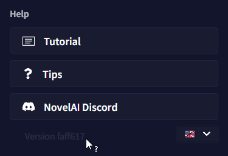
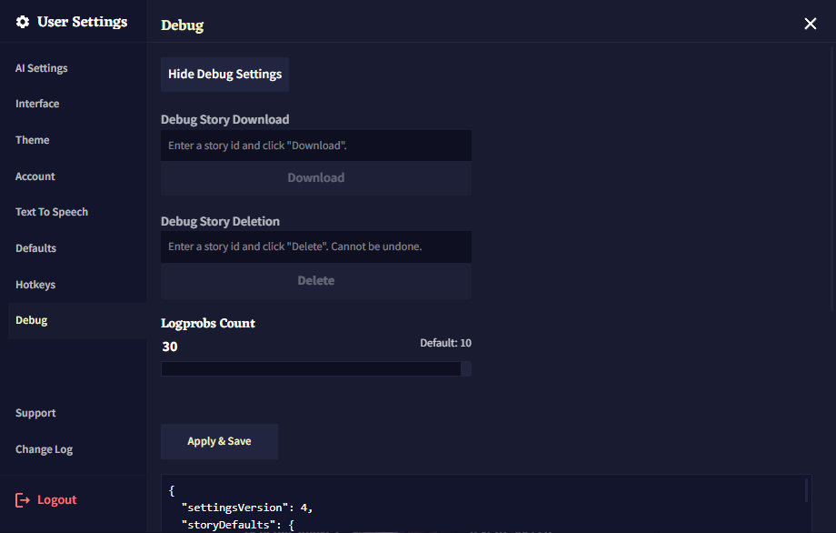
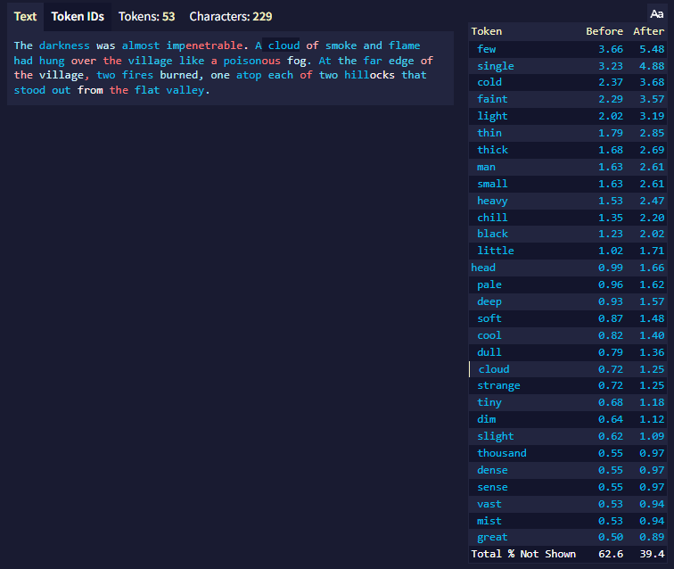

# Advanced: Debug Settings

디버그 세팅은 사용자의 계정 문제들을 해결하는데 도움을 줄 수 있는 고급 도구들 입니다.  **일부 번경 사항은 의도치않은 효과가 발생할 수 있으니 디버그 세팅에 접근할 때는 주의해야 합니다.**

## Enabling Debug Settings

디버그 세팅 메뉴를 활성화하기 위해서는 **goose** 메뉴 하단의 빌드 해시를 21번 클릭하십시오.

그러고나서 User Settings를 열면 디버그 세팅에 접근할 수 있습니다.

디버그 세팅 메뉴를 비활성화하고 싶다면 디버그 세팅 메뉴 내부의 **Hide Debug Settings** 버튼을 클릭하십시오. 그러고나면 다시 초기 *빌드 해시* 방법을 통해 잠금 해제 할 수 있습니다.

>  **Goose tip:**
디버그 세팅은 세션당 한 번만 잠금해제 할 수 있습니다. 그러므로 *빌드 해시*를 21번 클릭해도 디버그 세팅 메뉴가 뜨지 않는다면, 페이지를 새로고침 해보세요!

## Debug Story Download/Deletion

**디버그 메뉴**를 사용해서 다른 방법으로는 액세스할 수 없는 이야기를 *다운로드*하거나 *삭제*할 수 있습니다.

브라우저 주소창에서 선택된 이야기의 ID를 찾으십시오. 주소의 `/stories?id=`의 우측 부분 전체입니다. 예를 들어, 선택한 이야기의 주소가 `https://novelai.net/stories?id=be6a65e2-d7c8-4218-bba3-1234a1234a3a`이라면 **스토리 ID**는 `be6a65e2-d7c8-4218-bba3-1234a1234a3a` 입니다. 원하는 필드에서 ID를 입력하고나서 **Download**나 **Delete**를 클릭하십시오. 다운로드를 클릭한다면 해당 이야기는 즉시 다운로드될 것이고, 삭제를 클릭한다면 확인을 묻는 팝업이 표시됩니다.

## Logprobs Count

이 슬라이더를 사용하여 "Token Probabilities" 도구에서 얼마나 많은 대체 토큰을 표시할 지 설정할 수 있습니다. 최대 갯수는 30개입니다.

해당 설정은 영구적이며 로그아웃하거나 디버그 세팅을 숨겨도 계속 적용될 것입니다. **기본값은 10**입니다.

## Apply & Save

디버그 세팅 메뉴 최하단에는 몇 줄의 코드가 담긴 큰 텍스트 박스가 있습니다. 이것은 사용자의 NovelAI 설정으로서 필요한 경우 수동으로 값을 수정하거나 백업할 수 있습니다.

>  **Goose tip:**
Apply & Save 버튼은 아래 텍스트 박스에서 수동으로 설정이 변경된 경우에만 사용됩니다. 다른 디버그 세팅의 기능을 적용하기 위해서 해당 버튼을 누를 필요는 없습니다.
