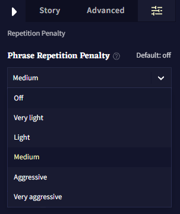

# Advanced: Phrase Repetition Penalty

이것은 개별적인 토큰이 아니라 토큰 시퀀스에 영향을 주는 것을 목표로 하는 새로운 반복 페널티 방법입니다. 예를 들어, 이야기의 다른 지점에서 특정 문장이 계속 나타난다면 구문 반복 패널티(Phrase Repetition Penalty)를 통해 해당 문장을 완성하기 어렵게 만들 수 있습니다.

첫번째 토큰은 생성되겠지만, 반복되는 문장의 두번째 토큰은 페널티를 받게 될 것이고, 그리고 세번째 토큰은 더욱 강한 페널티를 받는 식입니다.

**구문 반복 패널티는 다른 반복 페널티 설정과 독립적으로 작동됩니다.** 즉, **Rep Pen Range**이나 **Rep Pen Slope** 같은 다른 반복 패널티 설정에 영향을 받지 않음을 의미합니다. 하지만 **구문 반복 페널티**는 여전히 다른 반복 페널티와 함께 사용할 수 있으며 *이 반복 패널티들*은 동시에 *출력에 영향을 미칠 것입니다.*

해당 반복 패널티 방법의 또 다른 점은, 슬라이더를 갖지 않는다는 점입니다. 대신에 Phrase Repetition Penalty는 다음 중에서 선택할 수 있는 6개의 강도 증가 설정이 있습니다:

` Off, Very Light, Light, Medium, Agressive, Very Agressive.`

