# Advanced Settings

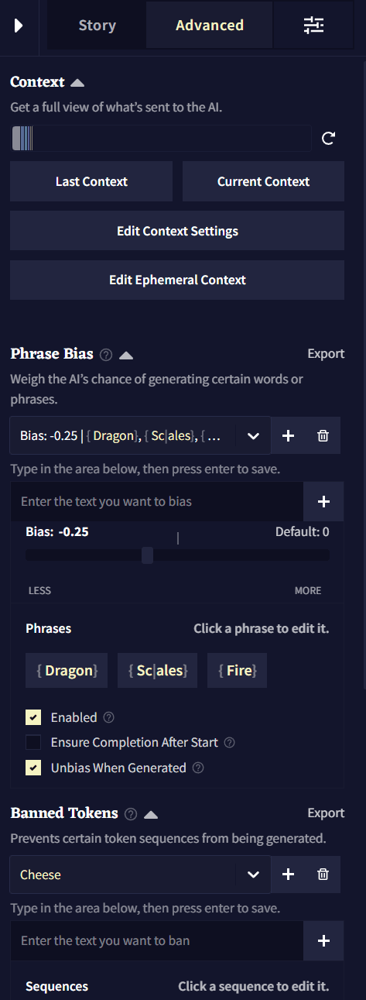

**고급 세팅Advanced Settings** 탭에서는 **Story Context** 등과 관련된 모든 옵션들이 있습니다! 처음에는 다소 압도감을 느낄 수도 있지만  **Phrase Bias**과 **Banned Tokens** 기능과 함께 **Context**를 이해하고 컨트롤하는 것은 모두 AI를 안내할 수 있는 강력한 방법입니다.


- [Context](#context)
    - [Context Viewer](#context-viewer)
    - [Context Settings](#context-settings)
    - [Ephemeral Context](#ephemeral-context)
- [Phrase Bias](#phrase-bias)
- [Banned Tokens](#banned-tokens)
- [Ban Bracket Generation](#ban-bracket-generation)
- [Stop Sequences](#stop-sequences)
- [Duplicate and Start as Scenario](#duplicate-and-start-as-scenario)


## Context

**컨텍스트Context**에서는 출력을 생성할 때, 사용자의 스토리가 AI에게 어떻게 보여지는지를 나타냅니다. **Advanced** 탭의 **Context** 섹션에서 컨텍스트가 자세하게 어떻게 보이는지와 컨텍스트를 조절하는 세팅을 볼 수 있습니다. **Ephemeral Context**도 역시 여기에 위치하고 있습니다. Ephemeral Context은 지연되거나 시간이 정해진 컨텍스트 항목을 생성하는 고급 방법입니다.

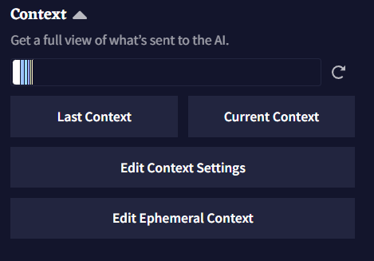

해당 탭 상단의 **Context Bar**는 가장 최근에 사용한 **Context** 내의 모든 텍스트에 대한 통계를 출처[^a]에 따라 색상으로 보여줍니다. 해당 표시줄에서 각 섹션에 마우스 포인터를 올려두면 토큰 수나 각 항목이 컨텍스트에서 몇퍼센트를 차지하고 있는지와 같은 자세한 정보가 들어있는 박스가 표시됩니다.

<p align="center">
<table style="border: 1px solid">
<tr>
<td>
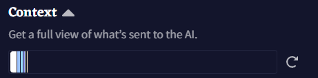
</td>
<td>
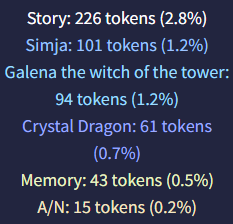
</td>
</tr>
</table>
</p>

>  **Goose tip:**
**Context Bar**는 얼마나 많은 정보가 사용되는지 뿐만 아니라 AI의 '두뇌'를 얼마나 사용할 수 있는지도 나타내요. 최대 컨텍스트 크기는 사용자의 구독티어에 따라 다르답니다.

**Last Context** 혹은 **Current Context** 버튼을 클릭하면 [Context Viewer](#context-viewer)가 열리고 스토리 컨텍스트에 대한 모든 통계가 표시됩니다. 더 많은 정보를 얻기 위해서는 하단의 [Context Viewer](#context-viewer) 섹션을 확인하십시오.

<p align="center">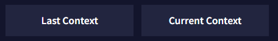</p>

**Edit Context Settings**은 [Context Settings](#context-settings) 창을 엽니다. 해당 창에서 **Context** 크기 내에서 스토리 컨텍스트 섹션의 토큰 예산을 책정하고 위치를 조절하고 다듬을*trim* 수 있습니다. 전체 분석을 위해서는 [Context Settings](#context-settings) 섹션을 확인하십시오.

<p align="center">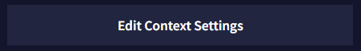</p>

[Ephemeral Context](#ephemeral-context)는 사용자의 현재 **스토리 단계Story Step**를 기반으로 하여 지연될 수 있거나 시간이 정해진 컨텍스트 항목을 만드는데 사용될 수 있으며, 이것은 [Story Settings Tab](./story_settings.md#story-options)의 **View Story Stats**에서 확인할 수 있습니다. 더 깊은 설명과 예제를 보기 위해서는 아래의 [Ephemeral Context](#ephemeral-context) 섹션을 확인하십시오.

>  **Goose tip:**
설정에 따라 **컨텍스트Context**와 **로어북Lorebook** 항목이 스토리 텍스트를 상쇄해버릴 수도 있고, 그 반대도 가능해요. **Context Viewer**를 사용하여 스토리의 모든 항목이 어떻게 작동하여 있는지 엿볼 수 있어요.

### Context Viewer

<p align="center">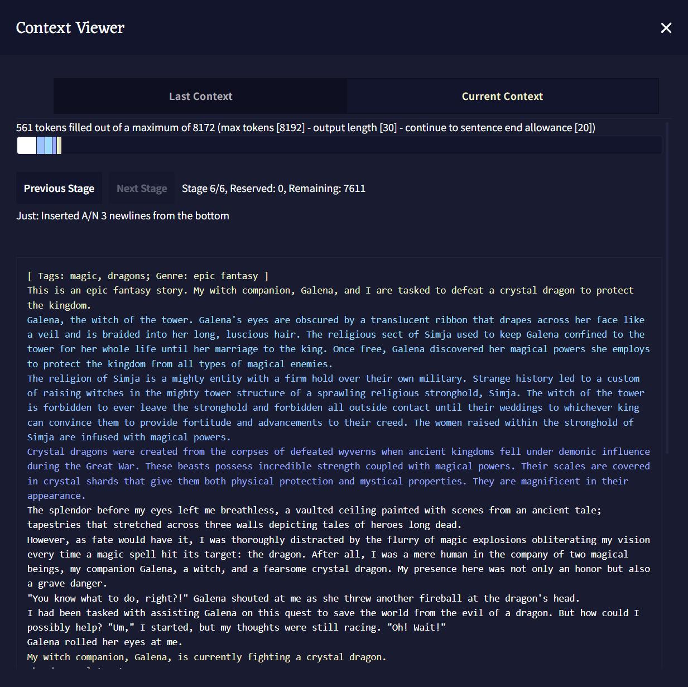</p>

**Context Viewer**에서 글 생성을 위해 AI에게 전달되는 스토리의 **컨텍스트Context**가 어떻게 생겼는지 볼 수 있습니다. **Lorebook** 항목, **Memory**, **Author's Note**와 **Phrase Biases**가 스토리에서 어떻게 다뤄지는지에 대한 상세 정보가 제공됩니다.

<p align="center">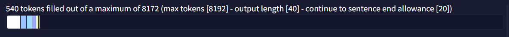</p>

**Context Viewer Bar:** 상단의 [Context](#context) 섹션에서 언급한 바와 유사하게, 해당 **Context Viewer Bar**도 스토리의 **Context**에 개별적인 색상과 이름이 붙여진 덩어리를 통해 시각적인 표현을 한 것입니다. 해당 표시줄의 각각의 색상에 마우스포인터를 올려두어 더 많은 정보를 볼 수도 있습니다.

>  **Goose tip:**
최대 컨텍스트 사이즈는 사용자의 구독티어와 [AI Settings](./ai_settings.md) 페이지에서 수동으로 설정한 **Max Context Size** 슬라이더에 의해 결정돼요.

<p align="center">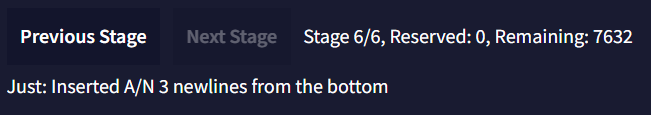</p>

**Stages:** 활성화된 로어북 항목, 메모리, 작가노트와 스토리의 텍스트 그 자체를 통해 **Story Context**를 만들 때, 모든 것이 **Stages**에 조직화되고 삽입됩니다. 스테이지 0에서 시작하여 [Context Settings](#context-settings)에 설정된 **Insertion Order** 값에 따라, 스토리의 각기 다른 모든 부분들이 함께 모여 스토리의 **Context**를 형성합니다. **Next**와 **Previous Stage** 버튼을 눌러 각 스테이지와 [Insertion Order](#context-settings)에 따라 각 항목이 배치되는 위치를 볼 수 있습니다.

<p align="center">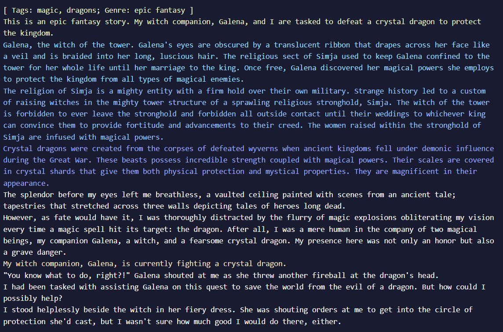</p>

주 **Context Viewer** 창은 스크롤 가능한 박스 안에 전체 컨텍스트를 보여줍니다. **Context Viewer Bar**와 유사하게 각 출처[^a]에 따라 다른 색상으로 표시된다.

<p align="center">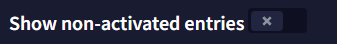</p>

**Show non-activated entries** 토글을 켜면 하단의 **Context Viewer Information** 박스를 확장하여 켜져는 있지만 비활성화 상태의 모든 로어북 항목을 보여줍니다.

<p align="center">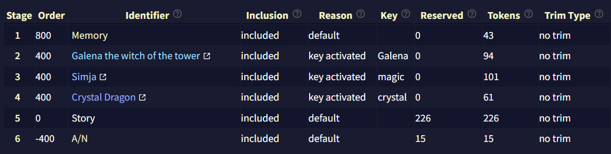</p>

**Context Viewer Information** 박스는 **Story Context**에 대한 또 다른 상세한 통계입니다. 해당 섹션은 로어북 항목과 **Story Settings** 박스에 대한 깊이 있는 정보를 보여줍니다.

- **Stage**: **Context**를 빌드할 때 항목이 삽입되는 stage를 보여줍니다.
- **Order**: **Lorebook**이나 **Context Settings**에 따른 항목들의 **Insertion Order**.
- **Identifier**: **Lorebook**이나 **Context Settings** 탭에서 표시되는 항목 이름.
- **Inclusion**: 항목이 **Context**에 포함되는지의 여부.
- **Reason**: 항목이 **Context**에 포함되거나 제외된 이유.
- **Key**: 해당하는 경우, 항목의 활성화 키.
- **Reserved**: **Lorebook**이나 **Context Settings** 설정에 따라 해당 항목에 예약된*reserved* 토큰의 수.
- **Tokens**: 항목의 활성 토큰의 수.
- **Trim Type**: **Lorebook**이나 **Context Settings**에서 정의된 설정에 따라, 다른 항목의 공간을 확보하기 위해 해당 항목이 잘리는 방법.

<p align="center">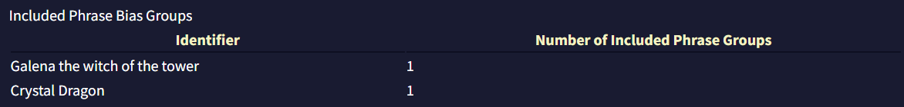</p>

마지막으로, **Included Phrase Bias Groups** 섹션은 


### Context Settings

**Context Settings** 메뉴는 4개의 비슷한 섹션을 담고 있습니다: **Memory Context Settings**, **Author's note Context Settings**, **Default Lorebook Settings**와  **Story Context Settings**, 그리고 최상단의 **Reset to Defaults** 버튼. [Lorebook](./lorebook.md) 섹션에서 다루는 **Default Lorebook Settings** 섹션을 제외하면 각 세션은 모두 같은 구성을 하고 있습니다.

<p align="center">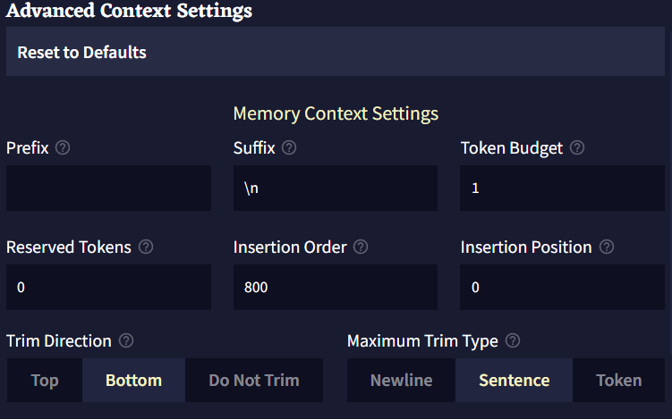</p>

- **Prefix**는 트리밍*trimming* 후 컨텍스트에 삽입하기 전에 항목 앞에 덧붙는 텍스트입니다.
- **Suffix**는 트리밍*trimming* 후 컨텍스트에 삽입하기 전에 항목 뒤에 덧붙는 텍스트입니다.
- **Token Budget**은 항목이 사용할 수 있는 컨텍스트의 최대 토큰 양입니다. 0과 1(제외) 사이의 십진법 소수점은 최대 컨텍스트 사이즈(최대 토큰 - 출력의 길이)의 백분율로 해석됩니다.
- **Reserved Tokens**은 항목이 자체적으로 예약할 수 있는 컨텍스트의 토큰 양입니다. 모든 예약은 항목들이 컨텍스트에 놓이기 전에 이뤄집니다. 항목은 자신이 실제로 가진 양을 넘는 토큰을 예약하지 않습니다. 예를 들어, 예약된 토큰이 200이고 항목의 토큰이 100이라면 100의 토큰만 예약될 것입니다.<div>
0과 1(제외) 사이의 십진법 소수점은 최대 컨텍스트 사이즈(최대 토큰 - 출력의 길이)의 백분율로 해석됩니다.</div>
- **Insertion Order**은 스토리 컨텍스트가 빌드될 때 항목들이 어떤 순서로 삽입/처리될 지를 나타냅니다. 높은 삽입 순서를 가진 항목은 토큰들을 예약하고 컨텍스트에 먼저 삽입될 것입니다. 만약 두개의 항목이 같은 삽입 순서를 같고 있다면 먼저 삽입될 것이라는 보장은 없습니다.
- **Insertion Position**은 항목이 컨텍스트에 삽입될 위치입니다. 0은 컨텍스트의 최상단을, 1은 한단계 아래, 2는 두단계 아래가 되는 식입니다. 음수는 컨텍스트의 가장 아래부터 계산됩니다. -1은 가장 아래, -2는 한단계 위로, -3은 두단계 위로가 되는 식입니다.
- **Trim Direction**은 전체 항목이 컨텍스트에 맞지 않을 때*do not fit* 항목을 자를 위치입니다. `Do Not Trim`으로 설정한다면 항목의 전체 텍스트가 컨텍스트 내에 맞을*fit* 때만 항목이 포함될 것입니다.
- **Maximum Trim Type**은 항목을 트리밍*trimming*할 수 있는 범위입니다.
- **Insertion Type**은 항목을 삽입할 때 컨텍스트를 구분하는데 사용될 단위를 결정합니다.


### Ephemeral Context

<p align="center">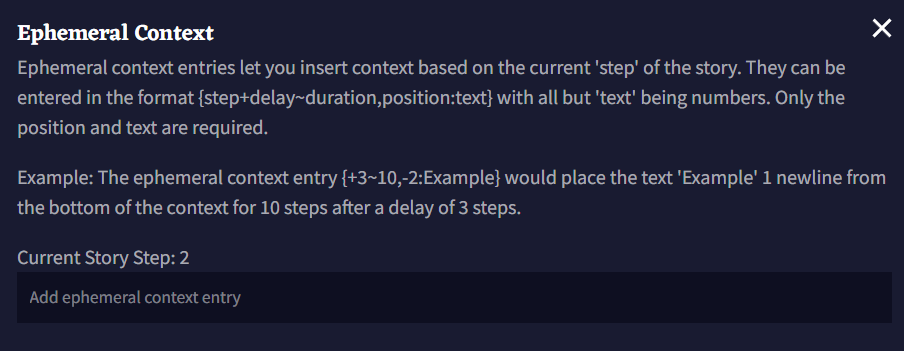</p>

위 이미지에서 볼 수 있듯이, Ephemeral Context 항목은 현재 **Story Step**([Story Settings Tab](./story_settings.md#story-options)의 **View Story Stats**에서 볼 수 있음)을 기반으로 **Context**에 텍스트를 삽입할 수 있게 해줍니다. 상단 이미지와 아래의 박스에 나타난 **Ephemeral Context** 항목의 예제를 봅시다. 항목은 4개의 부분으로 나뉩니다: **Delay**, **Duration**, **Insertion** 그리고 엔트리의 **Text**.

Ephemeral Context 항목은 중괄호 {}로 감싸져야 합니다.

```
 {+3~10,-2:Example} 
```

- **Delay**<div>
**Delay**는 **Ephemeral Context** 항목에 들어가는 첫번째 숫자이며, 앞에 `+`나 `-`를 붙여 스토리의 양수 혹은 음수 스텝을 지정할 수 있습니다. 딜레이를 `+0`으로 설정하면 항목이 즉시 활성화되며 숫자 뒤에 `r`을 추가하면 **Duration**이 충족된 후 항목이 반복됩니다. **Delay**보다 긴 **Duration**을 가진 항목은 한번 활성화되면 계속 반복할 것이기 때문에, 해당 항목이 간헐적으로 트리거되게 하려면 **Delay**를 길게 설정하십시오. 위 예제에서 **Delay**는 `+3`이므로, 이는 항목이 세 **Story Steps** 후에 활성화됨을 지정한 것입니다.</div>

- **Duration**<div>
항목의 **Duration**은 항상 `~` 기호를 앞에 붙이며, 몇개의 **Story Steps** 동안 항목이 활성화될지를 지정합니다. 예를 들어, Duration이 `~10`이면, 이것은 항목이 활성화되고 나서 10개의 story step 동안 항목이 활성화될 것임을 의미합니다.</div>

- **Insertion**<div>
**Insertion** 값은 항상 `,` 기호를 앞에 붙이며 **Duration** 값 뒤에 위치합니다. 항목의 삽입 위치를 지정하기 위해 숫자 앞에 `+`나 `-` 기호를 붙일 수 있습니다. `0`은 컨텍스트 상단, `-1`은 컨텍스트 하단입니다. 예를 들어, 해당 예제에서 텍스트는 컨텍스트 아래부터 한줄 위에 삽입됨을 의미합니다.</div>

- **Insertion** 값 다음의 **Text**는 **Ephemeral Context** 항목의 텍스트이며, 앞에 반드시 `:`가 있어야 합니다. 의도한 것이 아니라면 항목의 텍스트 앞에 공백을 두지 마십시오. `:`와 `}` 사이의 모든 텍스트가 그대로 삽입됩니다.

요약하면, 이 섹션의 시작 부분에 나열된 예제는 항목이 생성된 후에 `3` story step 후에, `10` story step 동안, 컨텍스트 하단으로부터 한 줄 위에 `Example`를 삽입할 것입니다.


<p align="center"></p>


>  **Goose tip:**
캐릭터가 저주받은 물건을 집었나요? 적이 랜덤한 간격으로 되돌아와 주인공을 위험에 빠뜨리나요? Ephemeral context는 더 많은 곳에서 사용할 수 있어요!


## Phrase Bias

**Phrase Bias**를 사용하면 해당 항목이 활성화되었을 때, AI가 특정한 단어나 구를 생성할 확률을 높이거나 낮출 수 있습니다. 정확한 텍스트를 입력하려면 bias를 중괄호 {}로 둘러싸면 됩니다. 토큰 ID(토크나이저에 지정된)를 넣기 위해서는 대괄호 []로 bias를 둘러싸면 됩니다. 입력된 텍스트는 **대소문자를 구분**합니다.

Phrase Bias를 만들기 위해서는 텍스트 영역에 입력을 하고 저장하기 위해 엔터를 누르십시오.

<p align="center">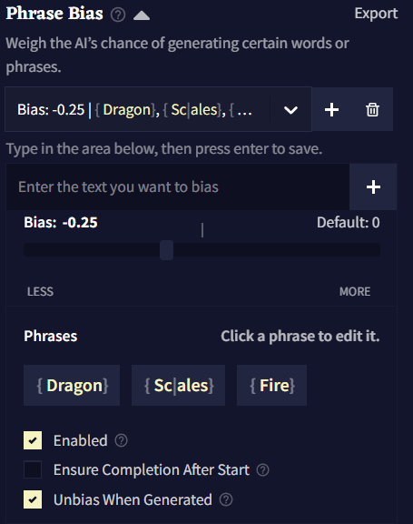</p>

**Import**와 **Export** 버튼을 클릭하여 `.bias` 파일로 Phrase Bias를 가져오거나 내보낼 수 있습니다.

Bias는 **그룹**으로 구성되는데 각 그룹에는 고유한 bias 값이 있고 해당 값은 그룹 내부의 모든 토큰과 구에 적용됩니다. 하나의 로어북 항목에 여러 그룹의 Phrase Bias을 가질 수도 있습니다.

새 bias 그룹을 만들기 위해서는  **Add** 버튼을 클릭하십시오.  **Delete** 버튼을 클릭하여 현재 선택된 그룹을 삭제할 수 있습니다.

**Bias Value**은 토큰의 그룹이 편향된 정도를 나타냅니다.

**Bias Value**의 효과는 사용하고 있는 **AI Model**에 따라 크게 다릅니다. 예를 들어, Krake는 다른 모델보다 bias에 민감하므로 소수점을 사용하는 것이 좋습니다.

<p align="center">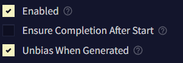</p>

**Enable**은 bias를 켤지 말지를 토글할 때 사용합니다.

**When Entry Inactive** 그룹의 활성화 동작을 반전시킵니다. 이것을 켜면, 항목이 활성화 상태가 아니라 비활성화 상태일 때 해당 bias 그룹이 적용될 것입니다.

**Ensure Completion After Start**가 활성화되면, 구*phrase*의 첫번째 토큰이 생성될 때 후속 토큰이 항상 생성됩니다.

**Unbias When Generated**이 활성화되면, 구*phrase*가 생성된 후 나머지를 생성하는 과정에서 해당 bias가 제거됩니다. 이 옵션은 해당 구가 생성되는 것을 막지는 않고, 그곳에 놓인 bias만을 제거할 뿐입니다.

## Banned Tokens

<p align="center">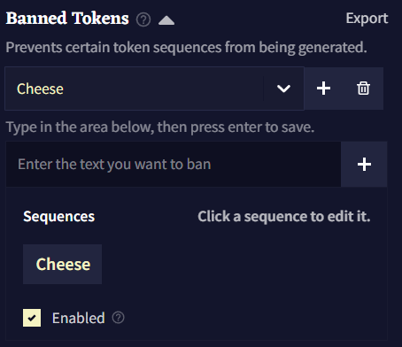</p>

**Banned Tokens**에서는 AI가 생성하는 토큰이나 시퀀스를 완전히 금지시킬 수 있습니다. 정확한 텍스트를 입력하려면 bias를 중괄호 {}로 둘러싸면 됩니다. 토큰 ID(토크나이저에 지정된)를 넣기 위해서는 대괄호 []로 bias를 둘러싸면 됩니다. 입력된 텍스트는 **대소문자를 구분**합니다.

>  **Goose tip:**
토큰을 금지*ban*할 때, AI는 밴하거나 bias 설정한 것을, 다른 철자를 사용하여 우회하려고 시도할 수도 있습니다. 새로운 밴 시퀀스를 만들 때는 여러가지 중요한 것들을 잊어선 안돼요!


## Ban Bracket Generation

<p align="center">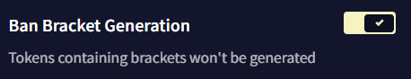</p>

**Ban Bracket Generation** 토글을 켜면 AI가 **[]** 대괄호를 생성하지 못하게 할 수 있습니다. 이 기능을 끄면 RPG 등에서 유용할 수 있습니다!


## Stop Sequences

<p align="center">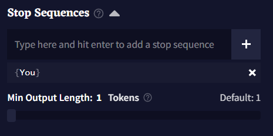</p>

**Stop Sequences** 박스에 토큰이나 단어를 입력하여 해당 글자가 나왔을 때 글 생성을 멈추게 할 수 있습니다. 하단의 **Min Output Length** 슬라이더를 조절하여 **Stop Sequences**가 작동*trigger*되기 전에 얼마나 길게 글을 출력을 할 지 결정할 수 있습니다.


## Duplicate and Start as Scenario

<p align="center">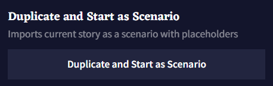</p>

**Duplicate and Start as Scenario** 버튼을 누르면 **로어북Lorebook** 및 설정들이 포함된 현재 스토리의 복사본이 생성되고, 임포트한 새 시나리오인 것처럼 시작됩니다. 플레이스홀더를 입력하면 다음 팝업에서 활성화되므로 공유하거나 리플레이할 시나리오를 테스트할 때 유용한 버튼입니다!

[^a]: 역주. 해당 항목이 로어북인지, 메모리인지, 작가노트인지.