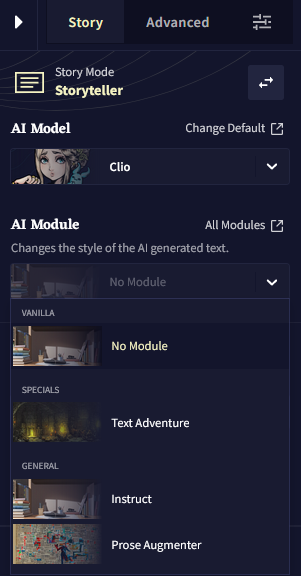
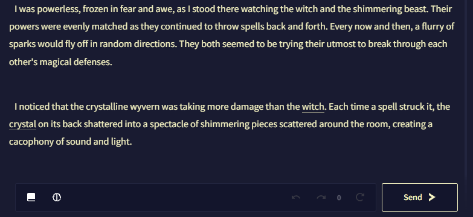

# Advanced: Special Modules

다음은 Clio와 Kayra 모델에서만 지원하는, NovelAI Text Generation의 새롭고 실험적인 모듈입니다.

## Instruct

이 특수한 모듈은 *AI에게 무엇을 계속 할지* 말하는 대신, **AI에게 무엇을 해야 할지** 알려줄 수 있습니다. 예를 들어, 이 모듈을 사용하여 AI에게 **직접 요청**을 하거나 단순히 글을 어떻게 이어나갈지 **방법을 말해줄 수** 있습니다. 이 **모듈**은 사용자가 지시하는 것을 { 중괄호 }를 사용하여 AI에게 지시하므로 일반적인 다른 모듈과는 다르게 작동합니다.

단순하게 `{`를 입력하면 **Instruct Block**이 만들어지며 여기에서 지시사항을 입력하면 됩니다. *해당 텍스트가 **에디터**의 블럭 내에 위치하는 한 이것은 지시instruction로 표시되기 때문에 중괄호를 닫을 필요가 없습니다.*

***Insturction Blocks**는 [Editor V2](./editor.md#editor-v2)에서만 동작하므로 해당 기능을 이용하기 위해서는 구버전의 이야기를 V2로 업데이트해야 한다는 사실에 유의하십시오.*

Instruct Block에서 *백스페이스*를 눌러 이전 줄로 이동하거나 빈 Instruct Block에서 *백스페이스*를 눌러 **Instruct Block**을 삭제할 수도 있습니다.

그리고 이 모듈의 독특한 점은 이것을 사용하기 위해 모듈 리스트에서 선택할 필요가 없다는 것입니다. 컨텍스트의 최근 1000자까지의 지시사항을 입력하기만 하면 모델은 출력을 위해 자동으로 **Instruct Module**을 사용합니다!

>  **Goose tip:**
Instruct Module을 사용하지 않을 때, 지시사항은 이야기에서 컨텍스트에서 제외됩니다.

그리고 마지막으로 **Instruction Blocks**은 ***에디터*** 전용이지만 지시사항은 메모리나 작가 노트와 같은 다른 장소에서도 사용할 수 있습니다.

{ 한칸 띄어쓰기한 중괄호 } 사이에 지시사항을 넣기만 하면 됩니다.

예를 들어: `{ Make the witch do a backflip at some point in the fight. }`

메모리나 작가노트에서의 { 한칸 띄어쓰기한 중괄호 } 사이의 지시사항은, 지시사항이 컨텍스트 범위 내의 1000 글자 범위 내에 있는 한, Instruct Module를 자동으로 활성화하는데에 사용할 수도 있습니다.

>  **Goose tip:**
중괄호 지시문은 *로어북* 엔트리에서도 작동해요!
>
> 약간의 창의력을 통해 강력한 자동화된 셋업을 만들수 있어요!

## Prose Augmenter

이 특별한 모듈을 사용하면 AI가 더욱 설명적이고 풍성한 글쓰기를 하게 할 수 있습니다. 이야기가 약간 건조해지기 시작했다면 이 모듈은 이야기를 더 풍부하게 만드는 훌륭한 도구가 될 것입니다.

>  **Goose tip:**
*Prose Augmenter*은 적당히 사용하는 것이 좋아요! 이 모듈은 큰 도움이 되지만, 너무 많이 사용한다면 AI는 글을 너무 화려하게 만드는데 집중하고 실제 플롯에는 주의를 덜 기울이기 시작할 수도 있어요.