# AI Settings

**AI Settings** 탭에는 여러 가지의 중요한 옵션과 외관을 담당하는 옵션이 있습니다: 텍스트 스트리밍, 문장 다듬기, 이야기에 재미있는 의견을 하게 설계된 해설 동반자인 [HypeBot](#hypebot)! 토큰 확률 표시와 강조, 문맥 길이 등의 실험적인 기능은 [Experimental](#experimental) 섹션에서 사용할 수 있습니다.

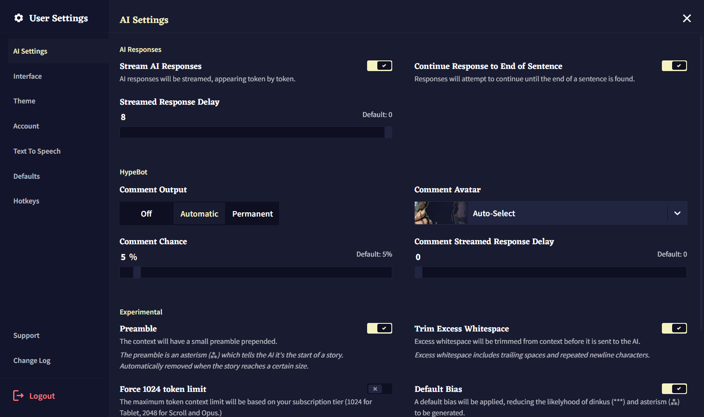

## AI Responses

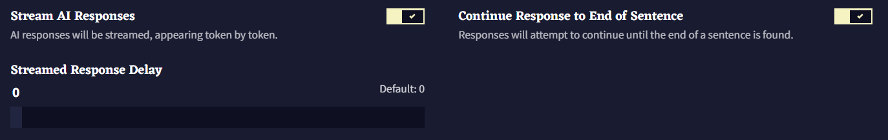

AI response 섹션에서는 토큰 스트리밍과 문장 다듬기 옵션이 있습니다. 이 설정들은 가독성 향상을 위해 기본적으로 활성화되어 있습니다.

### Stream AI Responses

**Stream AI Responses**을 켜면 한번에 글이 나타나는 것이 아니라, 글이 생성될 때마다 토큰 단위로 화면에 나타납니다. 아래의 **Streamed Response Delay** 슬라이더는 얼마나 빨리 텍스트가 스트리밍되는지를 조절할 수 있으며, 낮을 수록 빠른 속도를 나타냅니다.

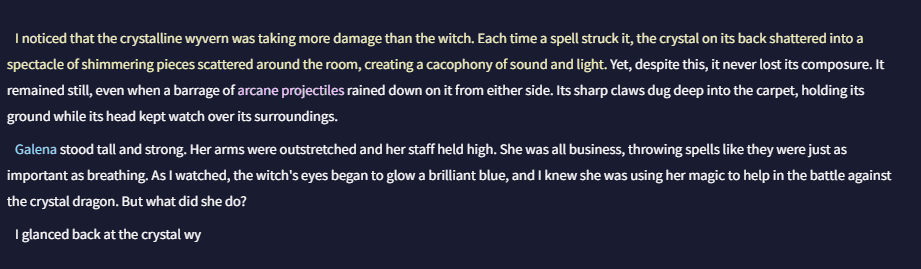

### Continue Response to End of Sentence

해당 토글을 비활성화하면 AI는 사용자가 설정한 **Output Length**에 도달할 때까지 글을 생성합니다. 이러면 문장 중간에 글 생성이 끝나는 결과가 발생할 수도 있습니다. 이 옵션을 켜면 온점이나 문장을 종료하는 다른 구두점에서 출력이 끝납니다.

## HypeBot

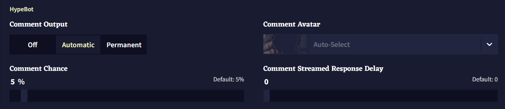

### Comment Output

**Automatic** 설정은 **Comment Chance** 확률에 의해 트리거될 때만 HypeBot이 나타나고 다른 출력이 생성되면 사라집니다. Comment Output을 **Permanent**로 설정하면 HypeBot이 항상 화면에 남아있습니다.

### Comment Avatar

드롭다운 메뉴에서 NovelAI의 여러 캐릭터들을 고를 수도 있고, Theme 탭의 고급 옵션에서 자신만의 아바타를 설정할 수도 있습니다.

>  **Goose tip:**

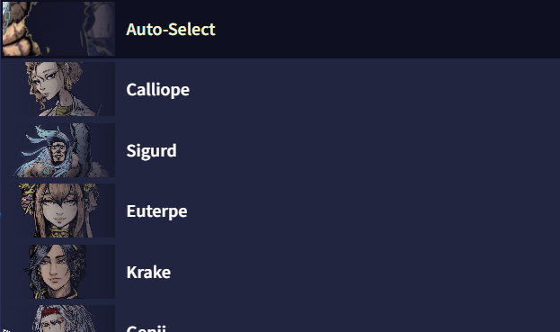

### Comment Chance

이 슬라이더는 얼마나 자주 HypeBot이 나와서 이야기할 지를 결정합니다. **Comment Output**이 permanent로 설정되어 있다면 HypeBot이 이전에 생성한 응답은 사라질 겁니다. 슬라이더를 0으로 설정하면 HypeBot을 끈 것과 같지만, 슬라이더를 100으로 설정하면 각각의 출력에 대한 HypeBot의 응답이 생성됩니다.

### Comment Streamed Response Delay

[AI response](#ai-responses) 섹션의 Delay 슬라이더와 마찬가지로, 이 슬라이더는 얼마나 빨리 HypeBot 텍스트가 스트리밍되는지를 결정합니다.

>  **Goose tip:**
에디터에서 HypeBot 아바타를 클릭하면 HypeBot의 새로운 출력이 나와요!

## Experimental

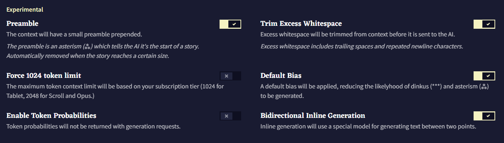

**Experimental** 섹션에서는 **Token Probabilities**처럼 글 생성에 대한 깊은 고찰을 하게 해주는 설정 뿐만 아니라 AI 출력에 영향을 미치고 AI가 스토리를 생성하는 방향을 유도하는 설정이 있습니다. 이 섹션의 기능들은 완료된 것이 아니며 장래에 크게 변할 수도 있습니다만 그렇다고 해서 이 부분을 확인하는 것을 멈춰서는 안됩니다!

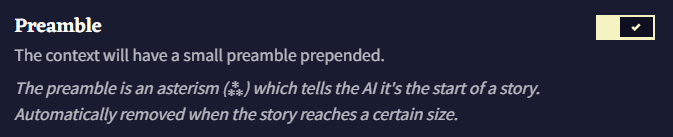

설명에 나온대로 **Preamble**은 컨텐스트 상단에 asterism (⁂)을 추가합니다. 이는 AI에게 이야기의 시작을 알리는 서식 지정 방법입니다.

>  **Goose tip:**
AI에게 채팅이나 리스트, 통계 분석 등 스토리 형식이 아닌 텍스트를 생성하도록 시킬 때는 이 옵션을 끄는 것을 고려해보세요.

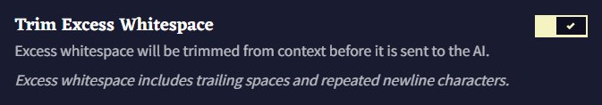

**Trim Excess Whitespace** 토글은 컨텍스트의 후행 공백과 반복되는 줄 바꿈을 제거합니다. 이것들은 AI의 생성에 문제를 일으킬 수 있기 때문입니다.

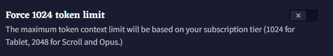

사용자의 구독 등급에 따라(Tablet에선 1024, Scroll과 Opus에선 2048) **Force 1024 token limit** 토글을 통해 컨텍스트 사이즈를 1024 토큰과 2048 토큰 간 전환할 수 있습니다. AI가 최근의 문맥과 행동에 더욱 집중하게 만들고 싶거나 낮은 구독 티어에 대한 이야기나 프롬프트를 작성하고 있다면 작은 컨텍스트 사이즈가 이득이 될 수도 있습니다.

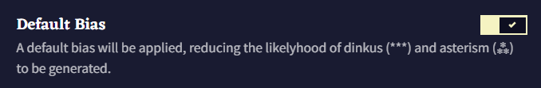

**Default Bias** 토글을 켜면, dinkus (***)와 asterism (⁂) 문자가 나타날 가능성을 줄이기 위해 `-0.12`의 바이어스가 적용됩니다. 결과적으로 스토리 중단이 줄어들고 스토리의 흐름이 길어집니다.

>  **Goose tip:**
Asterism (⁂)은 일반적으로 이야기의 시작이나 제목에 쓰이고, dinkus (***)는 챕터의 구분이나 시간이 지났음을 나타내요!

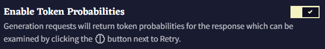

**Enable Token Probabilities** 토글을 체크하면 출력을 생성한 후, [Editor](./editor.md) 화면 하단의 **Retry** 버튼 근처에  아이콘이 나타납니다. (Editor V2를 사용하고 있다면  [Lorebook](./lorebook.md) 아이콘)

해당 아이콘을 클릭하면 **Token Probabilities** 창이 열립니다. 해당 창에서는 최근 생성에 대한 분석을 볼 수 있습니다. 토큰 또는 토큰 ID를 선택하면 각 토큰이 선택될 확률을 볼 수 있습니다.

<table style="border: 1px solid">
<tr>
<td width="150px">
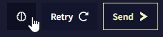
</td>
<td width="150px">
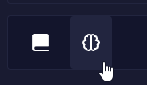
</td>
</tr>
</table>

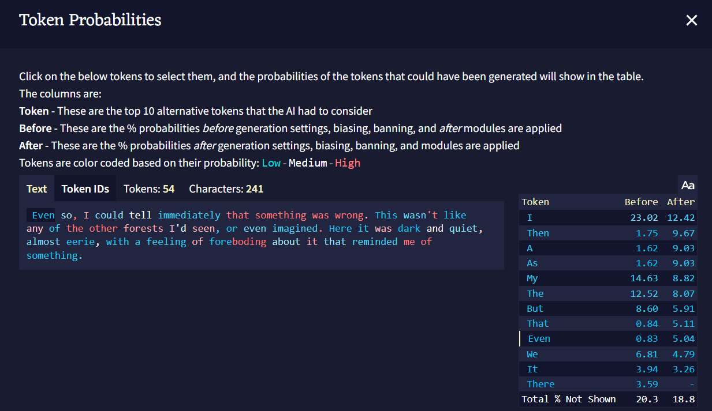

>  **Goose tip:**
Theme 탭에서 *Low*, *Medium*, *High* 확률에 사용되는 색을 볼 수 있고 커스텀할 수 있어요!

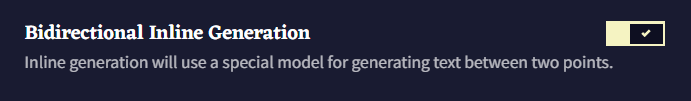

**Editor V2**나 inline generation hotkeys **(Shift + Ctrl + Enter/ Shift + Command + Enter)** 를 사용할 때, **Bidirectional Inline Generation** 토글은 Default 탭에서 사용자가 선택한 기본 모델을 사용할 지, 양방향을 모두 고려하여 글을 생성하는 특수한 모델을 사용할 지를 전환합니다.

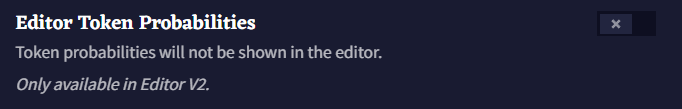

**Editor V2**가 활성화되었다면, 해당 체크박스는 **Editor** 윈도우에서 가장 최근의 출력 token probabilities을 강조합니다. 사용된 색상은 [Context Viewer](./editor.md)나 [Logical Probability Viewer](./editor.md)와 같으며 Theme 탭에서 설정한 색을 사용하여 토큰 확률에 따라 색으로 구분됩니다.

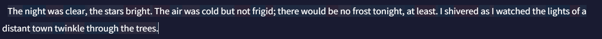

