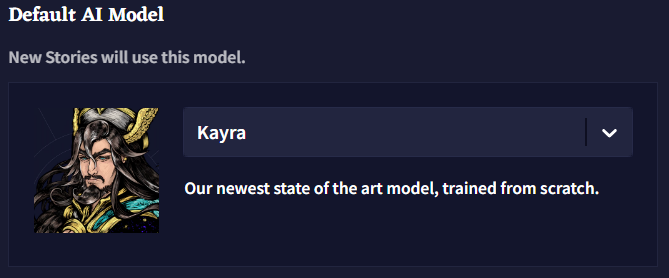
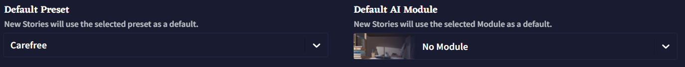
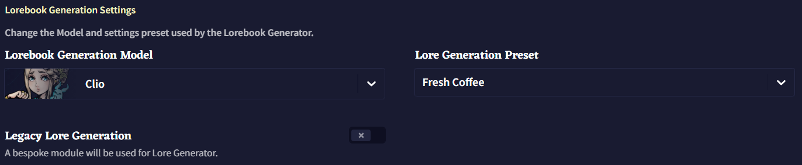

# Default
*Last contents updated 9/24/2024*

새 이야기를 시작할 때, 현재 페이지의 설정이 적용됩니다. **Defaults** 탭에서 사용자는 기본 모델과 프리셋, 모듈, 선호하는 **Lorebook** 설정을 할 수 있습니다.

## Default AI Model

기본값으로 설정하는 모델에 따라, 아래 드롭다운 메뉴에서 다른 프리셋과 모듈을 사용할 수 있습니다. 새로운 모델이 나왔을 때, 설정한 기본 모델은 자동으로 변경되지 않으니 반드시 변경하세요!

### Default Preset
각 모델은 기본 프리셋 세트가 같이 제공되지만, 직접 저장하거나 임포트인 자신만의 프리셋을 기본값으로 설정하여 새 이야기를 시작할 때 사용할 수 있습니다.

### Default AI Module
가장 좋아하는 모듈이 있나요? 텍스트 어드벤쳐만 플레이하나요? **Default AI Module** 드롭다운 메뉴를 사용하여 좋아하는 모듈이 로드된 채로 모든 이야기를 시작하세요. 오래된 모델은 커스텀 모듈 훈련도 지원하며 여기에서 설정도 할 수 있습니다.

## Lorebook Generation Settings

### Lorebook Generation Model
로어북 생성에 사용되는 모델을 변경할 수 있습니다. 예전 모델의 스타일을 선호하거나 단순히 테스트해보고 싶을 경우 **Lorebook Generation Model** 드롭다운 메뉴를 사용하여 변경할 수 있습니다.

### Lore Generation Preset
프리셋은 로어북 생성에서 다르게 작동할 수 있으므로 자신에게 가장 적합한 것을 선택하세요. 커스텀 프리셋도 이 드롭다운 메뉴에서 지원됩니다.

### Legacy Lore Generation
**Legacy Lore Generation** 토글을 사용하면 **Lorebook** 로어 생성 섹션의 레거시 모듈을 활성화합니다.

레거시 모듈은 켜졌을 때의 면책조항에 명시된대로 일관성이 떨어지는 퓨샷 프롬프트 기반 생성기 입니다.