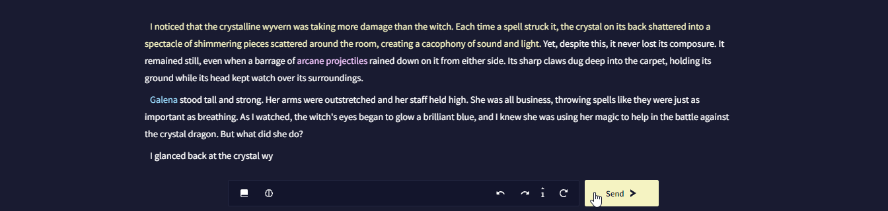

# Editor

**Editor**는 NovelAI에서 스토리를 작성할 때 상호작용하게 될 인터페이스의 주요 섹션입니다. 먼저 Editor에서 직접 글을 쓴 다음 **Send >** 버튼이나 **Ctrl + Enter (맥에서는 ⌘Command + Enter)** 를 누르면 AI가 생성을 시작합니다.

모든 AI 생성과 사용자 입력은 분기되는 타임라인처럼 **Edit History**에 저장됩니다.  **Undo** 버튼을 누르면 타임라인에서 한 스텝 뒤로 가고,  **Redo**는 한스텝 앞으로 갑니다.


 **Retry**나 **Alt + r (맥에서는 ⌥Option + r)** 를 누르면 마지막 AI 생성을 다시 보내서 매변 완전히 새로운 AI 출력물을 제공합니다.

**History** 버튼은 스토리의 현재 지점에서의 AI 생성의 수를 표시하고 어떤 것에 계속 이어 쓸지 선택할 수 있습니다.


Editor는 스토리에서의 글의 소스를 보여주기 위해 다양한 색상을 사용합니다.

- <span style="color:#F2F2B5">**초기 프롬프트**는 크림색으로 표시됩니다. AI 생성 이전에 처음으로 작성된 것입니다.</span>
- <span style="color:white">**AI가 생성한** 글은 흰색으로 표시됩니다.</span>
- <span style="color:#F0B6FE">**유저가 수정한 것**은 분홍색으로 표시되며, AI가 생성한 글에서 유저가 수정한 내용을 나타냅니다.</span>
- <span style="color:#8DD3FF">**유저 입력**은 파란색으로 표시되며, Editor에서 당신이 직접 작성한 글을 나타냅니다.</span>

이 색상들은 기본 "NovelAI Dark" 테마에 해당하며  **User Settings**의 테마탭에서 수정할 수 있습니다.

## Title

Editor 최상단에는 현재 스토리의 제목이 있습니다. 이것은 단지 관리적인 목적일 뿐이며 AI에는 영향을 미치지 않습니다.
 **Title Generation** 버튼은 스토리의 내용을 기반으로 창의적인 제목을 만들어냅니다 - AI가 어떤 제목을 만들지는 알 수 없습니다!

제목을 만든 후에는,  **Title Generation History** 버튼을 눌러 뒤로 돌아가거나 AI가 만들어낸 제목의 마지막 50개 중에 선택할 수 있습니다. *Note: Title Generation History는 현재 세션에서만 적용이 되며 NovelAI가 닫히면 지워집니다.*


## Hypebot


**Hypebot**은 이야기에 코멘트를 달고 이야기를 진행하는데 때떄로 도움을 주는 AI 동반자입니다!

 **User Settings**에서 사용된 초상화나 기타 설정을 바꿀 수 있습니다.

>  **Goose tip:**
Hypebot의 위트있는 코멘트가 마음에 들지 않나요?  **User Settings**의 AI 설정 탭에서 Hypebot의 코멘트가 얼마나 자주 나올지 조절할 수 있어요. Hypebot의 얼굴을 클릭하여 요청할 때만 Hypebot이 코멘트를 달게 할 수도 있어요!


## Input Box

**Input Box**는 Editor에 글을 작성하는 대신, 스토리에 글을 추가할 수 있는 대체 방법입니다. input box는 기본적으로는 꺼져 있지만  **User Settings**의 인터페이스 탭에서 활성화할 수 있습니다.

*Note: Input box는 Editor V2에서는 사용할 수 없습니다.*


## Inline Generation

스토리의 이전 지점을 클릭하고 **Shift + Enter**를 누르면 AI는 두 방향의 텍스트를 고려하여 두 지점 사이의 입력을 생성하는 특수한 모델을 사용하게 됩니다.

>  **Goose tip:**
  **User Settings**의 AI 설정 탭에서 *Bidirectional Inline Generation*을 꺼서, 마치 선택한 지점이 현재 컨텐스트의 끝인 것처럼 간단하게 글을 생성할 수 있어요.

## Context Menu


마우스 오른쪽 버튼을 클릭하면 선택한 글과 상호작용할 수 있는 바로바기로 채워진 특수한 컨텐스트 메뉴를 불러옵니다. 이 바로가기들은 선택한 텍스트를 로어북에 빠르게 추가하는 것부터, 더 많은 로어를 생성하기 위한 입력으로 사용하거나, 이야기의 스크린샷을 찍거나, TTS를 사용하여 글을 읽게 하는 것까지 다양합니다.

엠-대시(—)나 애스터리즘(⁂) 등의 특수 문자를 추가하는 바로가기도 있습니다.

>  **Goose tip:**
**Ctrl + Right Click**을 눌러 브라우저의 기본 컨텐스트 메뉴를 여는 것도 가능해요.  **User Settings**의 인터페이스 탭에서 *Swap Context Menu Controls*을 활성화해서 이 동작을 바꿀 수도 있답니다. 터치 스크린 장치에서는 이 설정과 상관없이 **Ctrl + Right Click**을 누르고 있을 때만 특수한 컨텍스트 메뉴가 보여져요.

### Screenshot Designer

컨텍스트 메뉴는 스토리의 선택된 부분을 쉽게 스크린샷 찍을 수 있도록 해줍니다.

**Screenshot Designer**를 통해 가장 기억에 남는 장면, 인상적인 대사나 주요 플롯을 쉽게 캡쳐할 수 있습니다.


## Token Probabilities

활성화되면, 모든 AI 생성은 응답에 대한 Token Probabilities를 반환하며,  버튼을 클릭하여 이를 확인할 수 있습니다.

토큰은 그 확률에 따라 색깔로 구분됩니다: <span style="color:#1BD9D6">Low</span>-Medium-<span style="color:#FB6065">High</span>

**Token Probabilities**은 AI가 글을 생성하는 동안 토큰을 얼마나 '자신있게' 선택하는지와 AI 생성 설정이 결과물에 얼마나 영향을 미치는지에 대한 측정을 제공합니다. 확률이 높은 토큰은 더 예측 가능한 선택을 나타내고 확률이 낮은 토큰은 덜 관습적이거나 위험한 선택임을 드러내는 신호입니다.


Token Probabilities은 기본적으로 꺼져 있으며 Token Probabilities을 켜기 위해서는  **User Settings**의 AI 세팅 탭으로 가서 *Enable Token Probabilities*를 클릭하십시오.


### Editor Token Probabilities

이 고급 사용자용 기능을 사용하면, Editor 자체에서 최근 AI 생성에 대한 토큰 선택을 볼 수 있습니다.

**Editor Token Probabilities**을 통해, 당신은 직접 작성할 필요없이 즉석에서 쉽게 AI를 올바른 방향으로 조정할 수 있습니다.


Editor Token Probabilities을 켜기 위해서는,  **User Settings**의 AI 세팅 탭으로 가서 *Enable Token Probabilities*와 *Editor Token Probabilities*를 활성화하십시오.


Editor Token Probabilities는 **Editor V2**를 사용한 스토리에서만 가능합니다.


## Text Formatting

Editor V2에서 배타적으로 글꼴 서식을 지정할 수 있습니다: *기울임*, **굵게**, <u>밑줄</u> 그리고 ~~취소선~~. 글자를 선택하고 서식 버튼을 누르거나 Ctrl+i (_기울임_), Ctrl+b (**굵게**), Ctrl+u (<u>밑줄</u>) 그리고 Ctrl+d (~~취소선~~)으로 같은 작업을 수행할 수 있습니다.


이것은 순수하게 시각적인 효과이며 AI는 서식이 지정된 글자와 보통 글자 사이의 다른 점을 보지 못한다는 사실을 염두에 두십시오.


## Highlight Speech

이 옵션을 활성화하면 따옴표 사이의 글이 에디터에서 강조됩니다. 반대로, 이 옵션을 **Inverted**하면 따옴표 밖의 글이 강조됩니다.

이 옵션을 켜기 위해서는  **User Settings**의 인터페이스 탭으로 가서 *Highlight Speech options* 중의 하나를 선택하세요. (Editor V2에서만 가능)


>  **Goose tip:**
만약 컬러로 강조된 글을 원한다면, Custom CSS theme에서 다음의 CSS를 사용하세요.
> ```
> .ProseMirror .dialogue {
>    color: rgb(254,249,205);
> }


## Editor V2

**Editor V2**는 기존의 텍스트 에디터의 개선판으로, 모바일 기기에서의 향상된 성능과 접근성을 위해 처음부터 만들어졌습니다.

Editor V2의 주요 특징은 다음과 같습니다:

- 자동, 그리고 수정 텍스트 포매팅.
- 긴 이야기에서 더 나은 성능을 위한 스토리 섹션의 다이내믹 로딩.
- 텍스트 포매팅과 다른 옵션에 빠르게 접근할 수 있는 에디터 도구상자.
- 텍스트 출처의 실시간 감지
- 히스토리 트리의 실행 취소/다시 실행 통합
- Editor를 떠나지 않고 이야기 저장하는 기능
- 모바일에서의 컨텍스트 메뉴
- Editor Token Probabilities 지원
- 더 쉬워진 지시 입력

기본적으로 **Editor V2**은 모든 사용자에 대해 켜져 있습니다. 여러 이유로 구버전 에디터로 돌아가고 싶다면,  **User Settings**의 인터페이스 탭에 가서 *Use Editor V2 for New Stories*를 끌 수 있습니다.

장래에 Editor V2가 구버전 에디터를 완전하게 대체할 거라는 것을 명심하십시오.


Editor V1에서 만든 이야기를 V2로 변환하기 위해서는 라이브러리 사이드바의  **Story Settings**을 열고 **Download Backup and Convert**을 클릭하십시오.


**Editor V2**를 사용하는 스토리는 라이브러리 사이드바의 클립 아이콘으로 확인할 수 있습니다.


