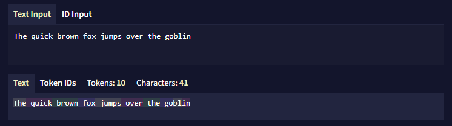

# Glossary
*Last contents updated 9/24/2024*

환영합니다! NovelAI의 새로운 사용자로서 익숙치않은 용어나 개념이 있을 수 있습니다. 이 용어 사전의 목료는 이 공식 문서에서 사용되는 용어를 간단히 설명하는 것입니다.

### AI Model
일명 대형 언어 모델 또는 LLM이라고도 합니다. 간단히 말해서, AI 모델은 깊은 학습 알고리즘을 사용하여 많은 데이터를 읽으며 학습합니다. 분석된 데이터의 엄청난 양은 AI가 언어를 이해하고 글쓰기를 계속하는 방법을 예측할 수 있게 합니다.

이 초기 훈련 후, AI 모델은 세심하게 선별된 데이터셋을 사용하여 AI의 능력을 더욱 향상시키는 '파인 튜닝'이라는 과정을 거칩니다. NovelAI의 파인 튜닝은 AI가 스토리텔링을 더 잘하도록 만드는 데 중점을 둡니다.

### AI Modules
소프트 프롬프트로도 불립니다. 모듈은 특정 스타일이나 장르에 대해 AI의 행동과 생성물에 직접적으로 영향을 미칩니다. 우리가 제공하는 **Default Modules**을 사용하거나 제공하는 훈련 데이터에 자신만의 [커스텀 모듈](./module_training.md)을 훈련시킬 수 있습니다.

### Anlas
NovelAI의 프리미엄 화폐입니다. NovelAI에 구독하면  Anlas를 받게 됩니다. 받는 양은 구독 티어에 따라 다릅니다. 또한, **갱신되는 구독**이 있다면 **유료 Anlas**를 구매할 수 있습니다.

현재 Anlas를 사용해야 하는 유일한 기능은 이미지 생성과 [커스텀 모듈 훈련](./module_training.md)입니다.

### Banned Tokens
AI가 특정 토큰 시퀀스를 생성하지 못하게 하는 데 사용됩니다.

사용자는 [고급 설정 사이드바](./slider_settings.md)에서 금지된 토큰을 설정할 수 있습니다.

### Config Preset
AI의 동작 방식을 조정하기 위한 특정 생성 설정 집합입니다. 이 매개변수에는 randomness, repetition penalty, sampling 방법과 적용 순서와 같은 요소가 포함됩니다.

각 AI 모델은 기본 구성 프리셋 세트를 갖추고 있습니다. 또한 자신의 요구에 따라 사용자 정의 프리셋을 만들 수도 있습니다.

### Context
AI가 출력을 생성하기 전에 볼 수 있는 토큰의 범위입니다. 컨텍스트는 이야기의 현재 지점에서 시작하여 최대 컨텍스트 크기에 도달할 때까지 거슬러 올라갑니다. AI에 관한 한 컨텍스트 외부의 모든 것은 사실상 발생하지 않은 것과 같습니다. 최대 컨텍스트 크기는 현재 구독 티어와 선택한 **AI 모델**에 따라 다릅니다.

컨텍스트가 빌드될 때, **Memory**, **Author's Note**, **Lorebook 항목**은 **삽입 설정**에 따라 컨텍스트에 주입됩니다.

### Dinkus
세 개의 애스터리스크(***)로 구성된 특별한 토큰으로, 주로 *장면이나 챕터의 분*리를 나타내는 데 사용됩니다.

### Phrase Bias
AI가 특정 단어나 구절을 생성할 가능성을 높이거나 낮추는 도구입니다. 부정적인 구절 편향 값은 가능성을 줄이고, 긍정적인 값은 높입니다.

Phrase Bias은 [고급 설정 사이드바](./slider_settings.md)와 [로어북](./lorebook.md)에서 설정할 수 있습니다.

### Prompt
이야기에서 AI 생성이 발생하기 전에 작성된 초기 텍스트입니다. 프롬프트는 AI가 생성할 내용의 기초를 제공합니다. 기본적으로, 프롬프트는 “NovelAI Dark” 테마에서 크림색으로 표시됩니다.

### Scenario
`.scenario` 파일은 이야기를 시작하기 위한 초기 프롬프트와 **Memory**, **Author's Note**, **Lorebook** 안의 모든 정보를 포함합니다. 시나리오는 또한 작가가 선택한 AI 모델과 설정 프리셋을 포함합니다. 시나리오를 불러올 때, 작가가 남긴 자리 표시자를 채우도록 요청받을 수 있습니다.

### Token
AI가 언어를 처리하고 생성하는 데 사용하는 기본 단위의 텍스트입니다. AI 모델은 단어를 개별 글자로 보지 않습니다. 대신, 텍스트는 토큰으로 나뉘며, 이는 단어 또는 단어 조각일 수 있습니다.

토큰이 배열되는 방식과 토큰 ID는 AI 모델이 사용하는 [토크나이저](https://novelai.net/tokenizer)에 따라 달라집니다.

예를 들어, "The quick brown fox jumps over the goblin." 이라는 문장은 GPT-NeoX 20B와 Krake가 사용하는 Pile 토크나이저로 "The| quick| brown| fox| jumps| over| the| go|bl|in."으로 토큰화되며, 각 |는 토큰 간의 경계를 나타냅니다.

### Token Probabilities
Logits라고도 불립니다. AI가 출력을 생성할 때, AI는 토큰풀에서 선택을 합니다. Token Probabilities는 AI가 각 토큰을 사용할 확률을 가리킵니다. 토큰의 % 확률은 생성 설정, bias, ban, 모듈에 영향을 받습니다.