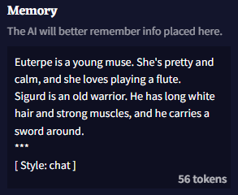
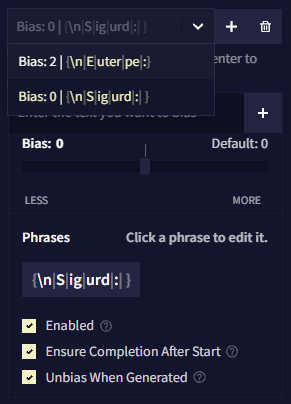
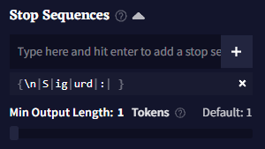
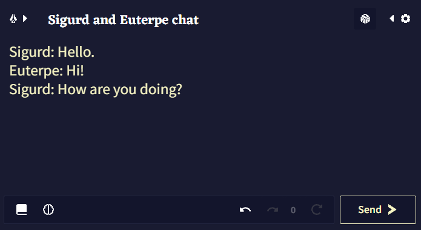

# Guide: Chat Format

다음은 AI가 두 캐릭터 간의 "채팅 스타일"의 내러티브를 유지하면서, 동시에 사용자 컨트롤 하에 캐릭터 중 한 명의 역할을 엄격하게 유지시키는 방법에 대한 간단한 가이드입니다.

이 페이지의 예제에서 아래 용어들을 다음과 같이 변경하십시오.

- `memory_information`: 여기에 캐릭터에 대한 정보나 일반적으로 **Memory**에 기억하고 싶은 다른 정보들을 기입하십시오. 이 부분에는 특정한 양식이 필요하지 않으며, **보통의 산문**도 좋습니다.
- `your_name`: 이것을 사용자 페르소나의 이름으로 바꾸십시오.
- `bot_name`: 이것은 AI 캐릭터의 이름으로 바꾸십시오.


## Memory

첫번째, **Memory**의 시작부분에 다음의 텍스트를 입력해야 합니다.

```
memory_information
***
[ Style: chat ]
```

이것은 AI가 실제 챗과 정보를 구분하는데 도움이 되며, 특히 `[ Style: chat ]` 태그를 훈련 데이터로 갖고 있는 **Clio Model**을 사용할 때 챗을 시작해야 한다는 것을 알게 하는데 도움이 됩니다.

여기에 사용자의 실제 메모리 항목을 기입한 후에는, 다음과 같은 모양을 하고 있을 것입니다:




## Story

그런 다음 원하는 채팅의 시작 부분을 다음처럼 작성해야 합니다:

```
your_name: Hello.
bot_name: Hi!
your_name: How are you doing?
```

물론 해당 용어를 실제 채팅 캐릭터의 이름으로 변경하십시오.

원하는 내용을 AI가 더 잘 파악할 수 있도록 캐릭터들 사이의 대화를 조금 더 세밀하고 알맞게 작성하는 것이 좋습니다.

하단에 줄바꿈 없이 **your character**로 줄을 끝내야 합니다.


## Phrase Bias

이 파트는 다른 파트보다 약간 더 복잡하지만, **Phrase Bias**와 그 세팅에 익숙하다면 어려울 것이 없습니다.

- **첫번째** *Bias 값*이 +2인 *Bias 그룹*을 하나 만들어야 합니다. Bias를 *활성화*하고 *Ensure Completion After Start*와 *Unbias When Generated*를 설정을 켭니다. 그리고 다음과 같은 문구를 입력합니다:
```
{\nbot_character:} 
```

예를 들어, AI가 *Euterpe*라는 캐릭터를 연기할 것이라면 `\nEuterpe:`라고 적으면 됩니다. *이 경우 {중괄호}를 닫기 전에 공백을 만들어선 안됩니다.*

- **두번째** *Bias 값*이 정확히 0인 *Bias 그룹*을 만들어야 합니다. Bias를 *활성화*하고 *Ensure Completion After Start* 설정을 켜고(다른 하나는 이것에 대해 차이가 없음) 다음과 같은 문구를 입력합니다:
```
{\nyour_character: }
```

예를 들어, 사용자가 *Sigurd*라는 캐릭터를 연기하고 싶다면 `\nSigurd:`라고 적으면 됩니다. *이 경우 {중괄호}를 닫기 전에 공백을 만들어선 안됩니다.*

Phrase Bias 설정은 다음과 같은 모양이 되어야 합니다:



>  **Goose tip:**
*봇 캐릭터*의 *Bias 그룹*이 *사용자 캐릭터*의 *Bias 그룹*보다 위에 있는지 확인하세요. 그렇지 않으면 작동하지 않아요!

## Stop Sequences

마지막으로 다음의 **Stop Sequence**를 스토리에 추가해야 합니다.

```
\nyour_character: 
```

다시 말해, 사용자의 캐릭터 이름과 동일한 bias 문구를 사용하되, **{중괄호}를 사용하지 않아야**됩니다. *끝 부분을 공백처리 하는 것을 잊지 마십시오.*

그리고 해당 bias가 항상 작동하도록 하기위해 **Min Output Length**을 `1`로 설정하십시오/




## Playing

이제는 **Send** 버튼을 누를 때마다, 항상 AI에게 지정된 캐릭터로부터 메세지를 받고, 사용자의 새로운 입력을 받기 위한 사용자 캐릭터의 이름이 뒤따릅니다.



출력되는 크기와 상관없이 AI의 "게시글" 끝에서 항상 출력을 종료하므로, AI가 사용자에게 더 긴 답변을 줄 때를 대비해서 **Output Length**를 최대 값으로 설정하는 것을 권장합니다.

하지만, 어떻게든 AI가 단일 출력에서 하나의 "게시글"을 끝내지 않는 경우에는 다음 출력에 대해 *봇 캐릭터의 Phrase Bias를 일시적으로 비활성화*할 필요가 있을 수도 있습니다.


>  **Goose tip:**
AI는 일반적으로 하나의 최대 크기 출력에 맞지 않을 정도로 킨 메시지 출력을 하지 말아야 합니다. 만약 이러한 문제를 겪고 있다면, *Repetition Penalties*를 낮춰보세요!

## Scenario File

이번 예제에서 사용한 **Sigurd & Euterpe** 예제가 담긴 `.scenario` 파일을 제공해드리겠습니다.

[NovelAI 공식문서 링크](https://docs.novelai.net/text/chatformat.html#scenario-file)

이것은 탬플릿으로 사용할 수 있는 단순한 베어본 예제라는 사실에 유의하세요. 더 나은 결과를 얻기 위해서 더욱 풍부한 **Memory**와 초기 대화를 작성하는 것이 이상적입니다.