# Interface

**Interface** 탭에는 텍스트 가독성과 버튼 사이즈 등을 조절하는데 필요한 모든 것들이 있습니다! 아래에서 각 기능에 대한 상세한 안내와 설명을 찾을 수 있습니다.

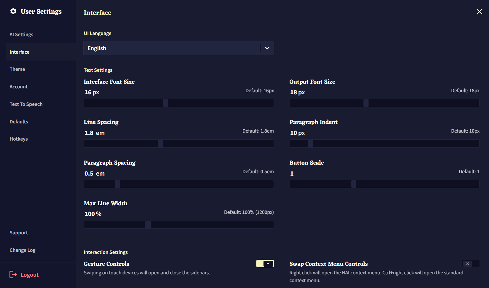

폰트 사이즈와 간격 외에도 해당 텝에서 철자교정과 입력 박스 같은 [Editor](./editor.md) 창의 특정 부분을 숨겨 더 부드러운 글쓰기 경험을 할 수 있을 뿐아니라, **Editor V2**와 **Minibar** 같은 실험적인 기능들도 활성화할 수 있습니다!

## UI Language

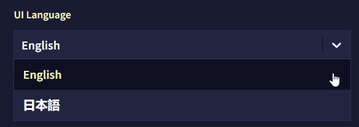

현재, NovelAI는 영어와 일본어를 지원합니다. 대부분의 주요 UI 요소는 번역이 되었으며 전체 번역은 현재 진행 중입니다.

>  **Goose tip:**
사용자 계정 드롭다운에서 깃발을 클릭하여 언어를 바꿀 수도 있어요!

## Text Settings

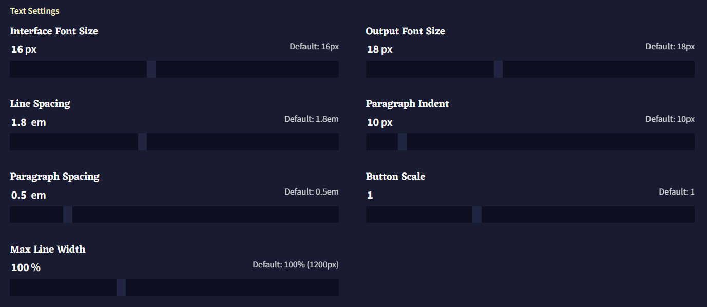

텍스트가 너무 작습니까? 혹은 너무 큽니까? 터치스크린에서 버튼을 선택하는데 어려움을 겪고 있습니까? **Text Settings** 슬라이더를 사용하여 NovelAI의 인터페이스를 원하는대로 리사이즈하십시오!

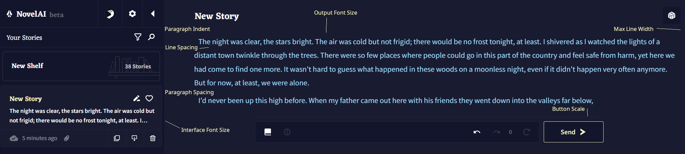

- **Interface Font Size**

**Interface Font Size** 슬라이더로 메인 **Editor** 창을 제외한 모든 텍스트의 크기를 바꿀 수 있습니다. 인터페이스 텍스트의 최대 크기는 24px이고 최소 크기는 10px 입니다.

- **Output Font Size**

**Output Font Size** 슬라이더는 **Editor** 창의 모든 텍스트 크기를 바꿉니다. 최대 값은 30px이고 최소 값은 10px 입니다.

- **Line Spacing**

**Line Spacing** 슬라이더는 텍스트의 개별 줄 사이의 간격을 조절합니다. 텍스트가 있는 줄이 서로 너무 가까워보인다면 **Paragraph Spacing**와 함께 이 슬라이더의 수치를 높여보십시오.

- **Paragraph Indent**

**Paragraph Indent** 슬라이더는 **Editor** 창의 문단 시작하는 부분의 들여쓰기 크기를 늘릴 수 있습니다. 이 들여쓰기는 각 개행 이후, 텍스트가 시작할 때 자동으로 놓입니다.

- **Paragraph Spacing**

**Paragraph Spacing** 슬라이더를 통해 **Editor**의 텍스트 문단 사이의 간격을 늘릴 수 있습니다. 이 슬라이더는 **Line Spacing**와 함꼐 작동하며 문단 사이에 추가적인 여백을 줍니다.

- **Button Scale**

**Button Scale** 슬라이더는 **Editor** 하단 **Input Bar**의 [Lorebook](./lorebook.md), **Undo** , **Redo** , **History**, **Retry** 와 **Send** 버튼의 크기를 조절합니다.

- **Max Line Width**

**Max Line Width** 슬라이더는 **Editor**의 텍스트가 가로 폭의 넓이를 변경합니다. 이 슬라이더의 값을 늘리면 텍스트는 화면의 가장자리 가까이에 닿게 되고, 슬라이더의 값을 낮추면 텍스트는 압축됩니다.

## Interaction Setting

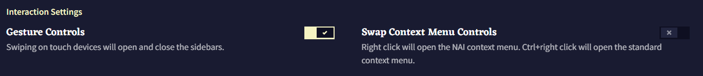

- **Gesture Controls**

**Gesture Controls** 토글을 사용하면 터치스크린 기기를 이용하는 사용자가 **Library**와 **Options** 사이드바에서 스와이프 기능을 토글할 수 있습니다. 해당 토글을 활성화하면 화면 가장자리를 스와이프하여 사이드바를 열고 닫을 수 있습니다.

- **Swap Context Menu Controls**
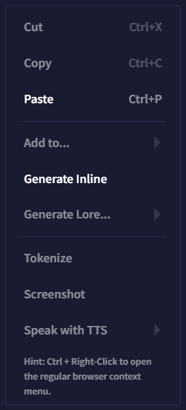

**Swap Context Menu Controls** 토글은 NovelAI [Editor](./editor.md)의 마우스 오른쪽 버튼 메뉴의 기능을 전환할 수 있습니다. 기본적으로 **오른쪽 버튼 클릭**은 NovelAI의 특수한 **Context Menu**가 열리고, **Ctrl + 오른쪽 버튼**은 시스템 컨텍스트 메뉴가 열립니다. 해당 토글을 비활성화하면 설정이 뒤집혀 **Ctrl + 오른쪽 버튼**이 NovelAI의 컨텍스트 메뉴가 됩니다.

## Other Settings

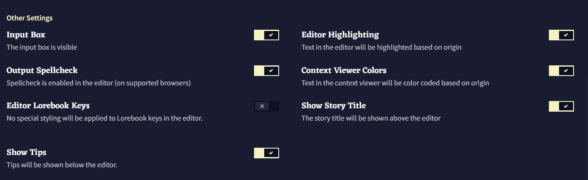

- **Input Box**
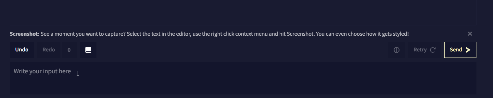

[Editor V1 전용] **Input Box** 토글은 **Editor** 하단의 인풋 박스를 비활성화합니다.

- **Editor Highlighting**
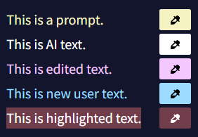

**Editor Highlighting** 토글은 원본과 Theme 탭에서 설정한 색에 따라 텍스트를 4가지의 다른 색으로 강조합니다.

- **Output Spellcheck**

**Output Spellcheck** 토글은 **Editor**의 철자 교정을 활성화하거나 비활성화합니다.

- **Context Viewer Colors**
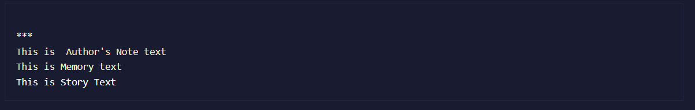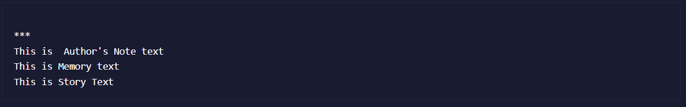

**Context Viewer Colors** 토글은 텍스트의 출처에 따라 **Context Viewer**의 텍스트 색상을 바꿉니다. 예를 들어, 기본적으로 메모리와 작가노트 박스의 텍스트는 서로 다른 음영있는 노란색으로 나타납니다. 이 토글을 끄면 **Context Viewer**에서 모든 텍스트가 기본 색상으로 나타납니다.

- **Editor Lorebook Keys**

[Editor V1 전용] **Editor Lorebook Keys** 토글은 에디터에서 로어북 키가 나타나면 [Lorebook](./lorebook.md) 키를 강조표시한다. 키는 굵게 강조처리되고 키 위에 마우스 포인터를 가져다대면 트리거된 **Lorebook Entry**의 이름이 보여진다.

- **Show Story Title**

**Show Story Title** 토글을 사용하면 **Editor** 창 산단에 표시되는 스토리 제목을 활성화하거나 비활성화할 수 있다.

- **Show Tips**
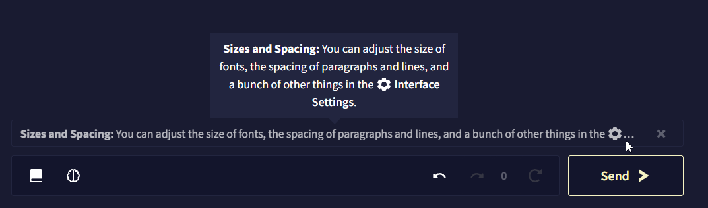

**Tips**는 **Editor** 하단, 입력 표시줄*input bar* 위에 나타난다. **Show Tips** 토글은 이것을 켜고 끌 수 있다.

## Experimental Settings

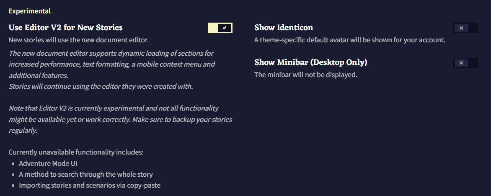

- **Use Editor V2 for New Stories**

**Editor V2**는 이 문서의 [Editor](./editor.md) 섹션에서 다루는 NovelAI Editor의 풀 리디자인된 에디터입니다. **Use Editor V2 for New Stories** 토글은 새 이야기를 작성할 때 적용됩니다. 해당 토글이 활성화되면 **Library Sidebar**를 통해 이전 이야기를 백업하고 **Editor V2**로 변환할 수도 있습니다!

- **Show Identicon**

**Show Identicon** 토글은 **Library Sidebar** 상단에 NovelAI 거위 마스코트의 테마별 아바타를 활성화합니다. 이 거위 identicon은 Theme 탭에서 사양자가 선택한 NovelAI의 테마에 따라 색상이 바뀝니다.

- **Show Minibar (Desktop Only)**

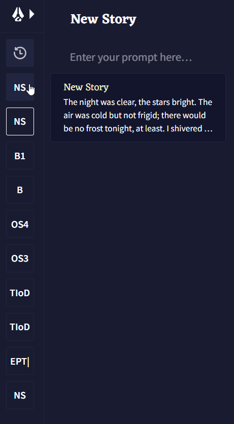

Minibar는 **Desktop Only** 기능입니다. 미니바는 축약된 스토리 제목들과 마우스로 호버 가능한 스토리 설명이 있는 미니 사이드바를 화면 왼쪽 사이드에 추가합니다. 미니바를 사용하여 **Library Sidebar**보다 덜 귀찮은 방법으로 스토리 사이를 빠르게 전환하십시오!

