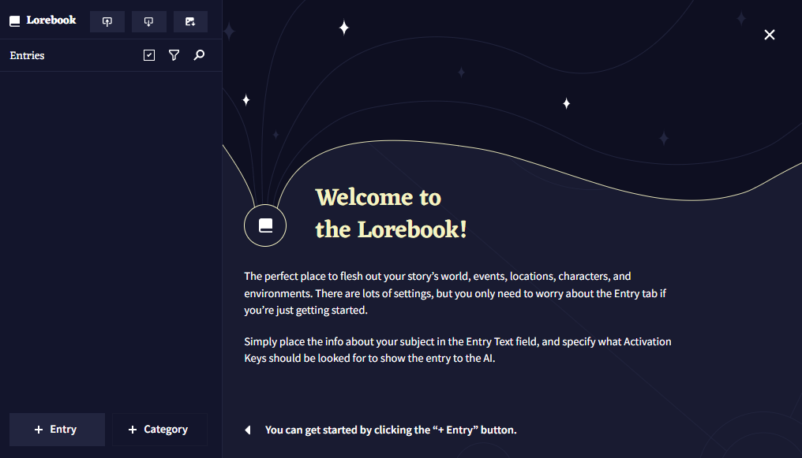
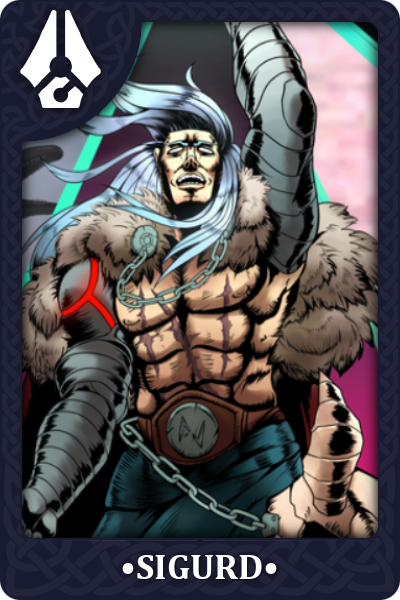
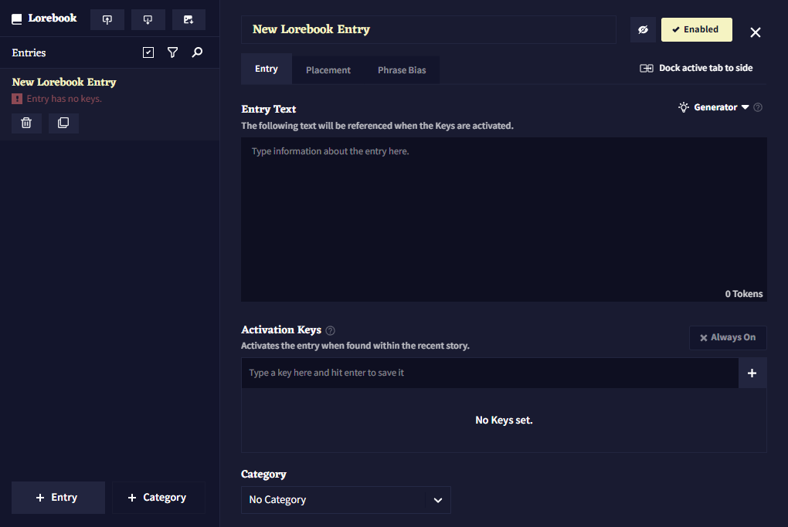
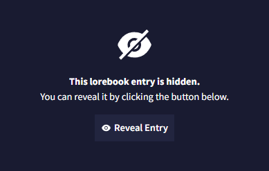
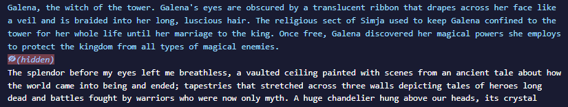
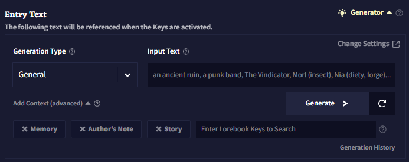
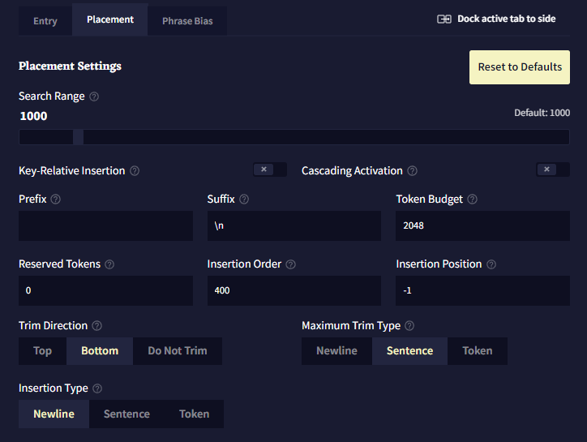
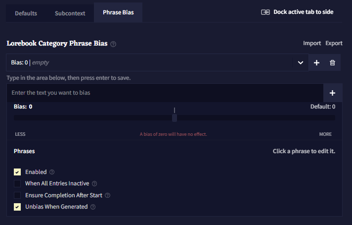
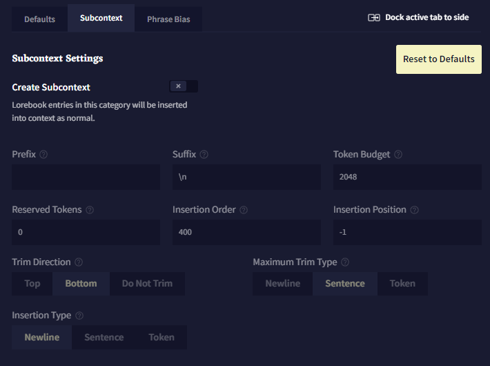

# Lorebook

 **Lorebook**은 스토리의 인물, 장소, 사물, 세력 및 기타 다른 내러티브적 요소에 살을 붙일 수 있는 완벽한 장소입니다. 스토리에 각 항목들이 나타날 때마다 AI의 컨텍스트에 추가되는 보충 정보를 위한 저장소라고 생각해도 됩니다. 내부에는 새로운 로어*lore* 항목을 생성할 수 있는 툴도 있습니다.

좌측 상단의 버튼으로 로어북을  **Import**하고  **Export** 할 수 있습니다.  **Image embed** 버튼으로 `.png` 이미지 파일 내부의 로어북을 삽입*embed*할 수도 있습니다. 다른 사람과 로어북을 공유하기 매우 좋은 방법입니다!

아래의 이미지는 삽입된*embedded* 로어북 항목의 예시입니다. 이 이미지를 다운로드해보고 이것이 어떻게 작동하는지 확인해보십시오!

>  **Goose tip:**
[NovelAI Discord](https://discord.gg/novelai)에는 NovelAI 커뮤니티가 만든 여러 로어북과 기타 창작물로 가득한 컨텐츠 공유 채널이 있어요!

 **Selection** 아이콘은 삭제할 여러개의 항목을 선택하거나 내보낼 항목을 선택하는데 사용됩니다.

 **Sort** 아이콘은 항목을 알파벳순이나 최신순으로 정렬할 때 사용됩니다.

 **Search** 아이콘은 검색을 할 때 사용됩니다.

## Entries

**Entries**는 로어북의 메인입니다. 각 항목은 자신만의 고유한 활성화 키를 갖고 있고, 최근의 컨텍스트에서 해당 키가 발견되면, 해당 항목의 텍스트가 컨텍스트에 삽입되게 됩니다.

 **Delete** 버튼은 선택된 엔트리를 삭제하고,  **Duplicate** 버튼은 선택된 엔트리를 복사합니다.

**Entry title**은 정리 목적으로만 사용되며 AI에게는 보이지 않습니다. 그렇기 때문에 사용자는 항목 텍스트 내부 어딘가에 항목의 제목*entry title*을 넣어야 합니다. 그렇지 않으면 AI는 이 항목이 어떤 것에 관한 것인지 알지 못할 것입니다.

항목 우측의  **Enabled** 토글은 해당 항목이 활성화되어 있는지를 결정합니다.  **Disabled** 항목은 키가 트리거되어도 컨텍스트에 삽입되지 않을 것입니다.

**Entry Text**는 해당 항목이 활성화되었을 때 컨텍스트에 들어갈 텍스트입니다.

**Activation Keys**는 최근 이야기에서 발견되었을 때 로어북을 활성화시키는 단어나 문구입니다. 키는 대소문자를 구분하지 않습니다.

`/`로 시작되고 끝나는 키는 정규표현식으로 평가됩니다. 이 정규표현식은 대소문자를 구분하고 다음과 같은 플래그를 지원합니다: `i`, `s`, `m`, `u`. 만약 키가 플레이스홀더의 일부라면, 첫번째 `/` 앞, 즉 가장 앞에 `$`를 추가하세요.

>  **Goose tip:**
정규표현식은 러닝 커브가 가파른 어려운 주제입니다. 정규표현식에 대해 더 공부하고 싶다면 [RegExr](https://regexr.com/)를 확인해보세요.

**Always On**이 켜져있다면, 해당 항목은 최근 스토리에서 키가 발견되는 것과는 상관없이 항상 컨텍스트에 삽입됩니다.

 **Hide** 버튼은 해당 항목을 숨김처리하여 별도로 공개표시를 하지 않는한 항목의 내용을 볼 수 없게 만듭니다. 해당 기능은 다른 사람과 공유할 목적의 시나리오를 만들 떄 유용하며, 플레이어에게 세부 정보를 숨길 수 있도록 해줍니다.

숨겨진 항목은 컨텍스트 뷰어에서도 가려집니다.

### Generator

로어북을 작성하고 싶지만 어디서부터 시작해야 할지 감이 안 오십니까? 그렇다면 AI가 그 빈칸을 채울 수 있도록 해보십시오!

**Lore Generator**는 사용자가 생각할 수 있는 모든 캐릭터, 사물, 장소나 개념에 대한 로어북을 만들수 있게 해주는 강력한 도구입니다. 일단 리스트에서 항목의 타입을 선택하고 생성하고 싶은 내용을 입력한 후에 생성*generator*을 누르십시오. 에디터에서와 마찬가지로 이미 작성된 로어북 항목에, AI에게 텍스트를 추가로 입력하라고 시킬 수도 있습니다.

**Generation Type**은 제네레이터가 특정한 항목의 타입을 생성하는데 영향을 줍니다. 클릭하여 드롭다운을 열고 타이핑을 하고, 엔터를 침으로써 사용자 정의 타입을 설정할 수 있습니다.

**Input Text**는 제네레이터가 사용하는 프롬프트입니다. "Fogwood Keep" 같은 이름이나 "an enthusiastic merchant"과 같은 짧은 설명이 가장 잘 작동합니다. 항목을 더 자세히 설명하기 위해 소괄호로 태그를 추가할 수도 있습니다. 에시: "Black Skull Fleet (pirates, space)"

**Add Context (advanced)**를 사용하여 메모리나 작가노트, 최근의 스토리(~2500자) 혹은 다른 로어북 항목을 컨텍스트에 포함시켜 항목을 생성할 때 해당 정보를 사용할 수 있도록 할 수 있습니다.

**Generation History**는 로어북 제네레이터의 최근 출력 50개를 보여줍니다. 페이지를 새로고침하면 삭제됩니다.

 **Change settings**를 클릭하여 로어북 제네레이터에 사용된 모델과 세팅 프리셋을 바꿀 수 있습니다.

## Placement

**Placement** 탭에서는 스토리 컨텍스트에 로어북 항목이 삽입되는 위치와 방법을 바꿀 수 있습니다.

*Note: Placement 탭은 숙련된 사용자를 위한 탭입니다. 해당 기능의 사용 방법과 효과를 이해하고 있는 경우에만 placement 값을 바꾸십시오.*

**Search Range**는 키를 검색할 스토리의 글자의 수 입니다. 최대값은 10000입니다.

**Key-Relative Insertion**은 컨텍스트 내에서 검색되는 로어북의 마지막 키에 대해 상대적으로 로어북 항목을 삽입하게 합니다.[^Key-Relative Insertion]

양수 Insertion Position은 키 뒤에 항목을 삽입합니다.

음수 Insertion Position은 키 앞에 항목을 삽입합니다.

해당 설정이 켜진 항목은 일반적으로 스토리 컨텍스트(기본적으로 0)보다 낮은 Insertion Order를 갖고 충분한 양의 예약된 토큰을 가져야 합니다. 대량의 상대적으로 삽입된 로어북 항목은 컨텍스트 생성을 느리게 할 수도 있습니다.

**Cascading activation**이 켜지면 해당 로어북 항목은 비(非)스토리 컨텍스트 항목에서 키를 검색할 것입니다. 비(非)스토리 컨텍스트 항목에서는 검색 범위가 고려되지 않으며, 활성화를 일으킨 항목의 텍스트가 컨텍스트 내에 있을 것이라는 것이 보장되지 않습니다.[^Cascading activation]

**Prefix**는 로어북의 내용이 트리밍된 후 컨텍스트에 삽입하기 전에 항목 앞에 추가되는 텍스트입니다.[^add]

**Suffix**는 로어북의 내용이 트리밍 후 컨텐스트에 삽입하기 전에 항목 끝에 추가되는 텍스트입니다.[^add]

**Token Budget**은 로어북 항목이 사용할 수 있는 컨텍스트의 최대토큰의 양입니다.

0과 1(1은 제외)사이의 십진수 소수점을 입력하면 최대 컨텍스트 사이즈(최대 토큰 - 출려 길이)의 백분율로 해석될 것입니다.

**Reserved Tokens**은 항목이 자체적으로 예약할 수 있는 컨텍스트 토큰의 양입니다. 모든 예약은 항목이 컨텍스트에 배치되기 전에 이루어집니다. 실제 해당 항목이 포함하는 토큰의 양보다 더 많은 토큰을 예약하지는 않습니다. 예를 들어, 예약된 토큰이 200으로 설정되고 로어북 항목이 100 토큰이라면, 100개의 토큰만 예약됩니다.

0과 1(1은 제외)사이의 십진수 소수점을 입력하면 최대 컨텍스트 사이즈(최대 토큰 - 출려 길이)의 백분율로 해석될 것입니다.

로어북의 항목은 컨텍스트가 빌드되기 전에, 설정된 **Insertion Order**에 따라 처리됩니다. 높은 Insertion Order를 가진 항목은 토큰을 예약하고 컨텍스트에 먼저 처리, 삽입됩니다. 두 항목의 Insertion Order가 같다면, 먼저 삽입될 것이라는 보장은 없습니다.[^Insertion Order]

**Insertion Position**은 항목이 컨텍스트에 삽입될 위치입니다. 0은 컨텍스트의 최상단, 1은 한단계 아래, 2는 두단계 아래가 되는 식입니다. 음수는 컨텍스트 컨텍스트 최하단부터 계산합니다.. -1은 최하단, -2는 그보다 한단계 위, 그리고 -3은 두단계 위가 되는 식입니다.[^Insertion Position]

**Trim Direction**는 전체 항목이 컨텍스트에 맞지 않을 경우*do not fit* 항목이 잘릴 위치를 설정합니다. 'Do not Trim'으로 설정하면 항목의 텍스트가 컨텍스트가 맞을 때만 항목이 포함됩니다.

**Maximum Trim Type**은 항목이 잘릴 수 있는 범위입니다.

**Insertion Type**은 항목을 삽입할 때 컨텍스트를 구분하는 데 사용되는 단위를 결정합니다.

---
[^Key-Relative Insertion]: 역자주: 로어북의 내용이 설정한 위치가 아니라 마지막으로 검색되는 키의 바로 뒤나 앞에 붙게 하는 기능이다.

[^Cascading activation]: 역자주: 스토리의 내용뿐만 아니라 메모리나 작가노트까지 로어북 키를 검색한다.

[^add]: 역자주: 만약 로어북 내용이 `abcd`이고 prefix가 `english`면, 최종적으로 `englishabcd`가 컨텍스트에 삽입된다. suffix라면 `abcdenglish`가 삽입된다.

[^Insertion Order]: 역자주: 처리하는 순서를 말한다. 값이 높다면 해당 값을 먼저 컨텍스트에 넣는다. 즉, 해당 값이 낮은 로어북은 처리 우선순위가 낮으므로 공간 절약을 위해 삭제될 수도 있다.

[^Insertion Position]: 역자주: Insertion Order 대로 값을 처리한 후 항목이 삽입되는 위치이다. 예를 들어, 기본값 기준으로 메모리는 Position 0 Order 800, 스토리는 Position -1 Order 0, 로어북은 Position -1 Order 400, 작가노트는 Position -4 Order-400으로 설정되어 있다. 그러므로 일단 메모리를 가장 먼저 컨텍스트에 넣고 위치를 가장 위로 놓는다(`메모리`). 그리고 로어북을 컨텍스트에 넣고 위치를 하단에 넣는다(`메모리-로어북`). 그리고 스토리를 컨텍스트에 넣고 위치를 하단에 놓는다(`메모리-로어북-스토리`). 그리고 Insertion Order가 -400인 작가노트를 컨텍스트에 넣고 -4(가장 아래에서 4번째줄) 위치에 놓게 되는 것이다. 즉, Insertion Order 순서대로 컨텍스트에 넣고 Insertion Position 값에 맞게 위치를 조절하는 것이다. 해당 부분은 [Context Viewer](./advanced_settings.md#context-viewer)의 Stages 란에서 Previous Stage와 Next Stage를 클릭하며 확인할 수 있다.

## Phrase Bias

**Phrase Bias**를 사용하면 항목이 활성화되어 있을 때, AI가 특정 단어나 구문을 생성할 확률을 높이거나 낮출 수 있습니다. 정확한 텍스트를 입력하기 위해서는 bias를 {중괄호}로 감싸고, 토큰 ID(토크나이저에 지정된)를 입력하기 위해서는 [대괄호]로 감싸십시오. bias는 대소문자를 구분합니다.

**Import**와 **Export** 버튼을 클릭하여 phrase Bias를 `.bias` 파일로 가져오고 내보낼 수 있습니다.

Bias는 **group**으로 구성되어 있고, 각 그룹은 **Bias** 값을 갖고 있습니다. 이 bias 값은 

## Categories

**Categories**는 로어북 항목을 그룹으로 정리하는데 사용됩니다.

**Default** 탭에서는 해당 카테고리 내에서 만든 새 항목의 기본 배치 설정을 바꾸거나 기존의 모든 항목을 업데이트할 수 있습니다.

**Subcontext**탭에는 **Create Subcontext** 토글이 있습니다. 이 토글을 활성화하면 해당 카테고리 내의 로어북 항목들이 그룹화되고, 이 그룹화된 항목들은 선택된 설정을 이용하여 컨텍스트에 삽입됩니다.

**Phrase Bias** 탭은 개별 엔트리 항목의 phrase bias 탭과 동일한 기능이지만, 카테고리 레벨에서 설정된 bias는 해당 카테고리 내의 모든 항목이 활성화가 될 때 활성화된다는 점이 다릅니다.

