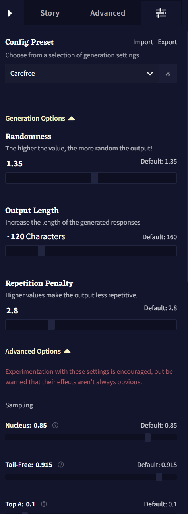
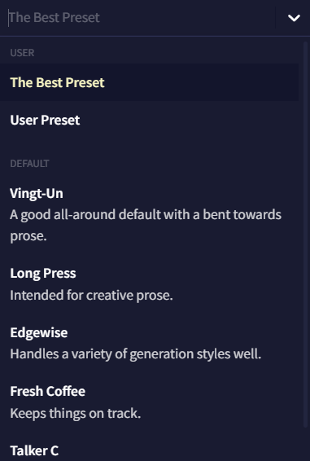
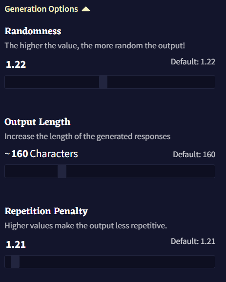
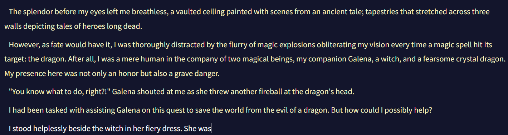
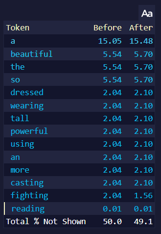
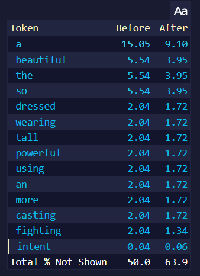
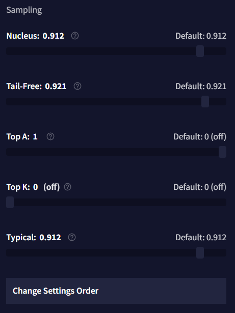
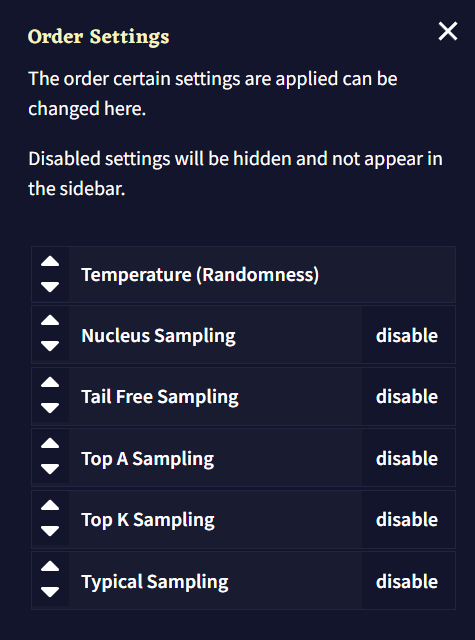
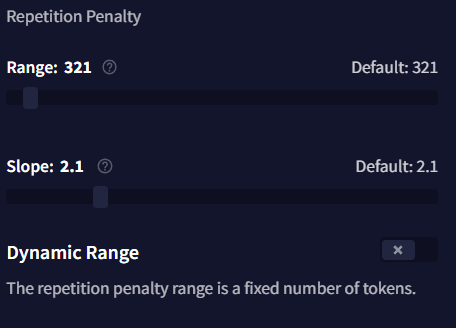
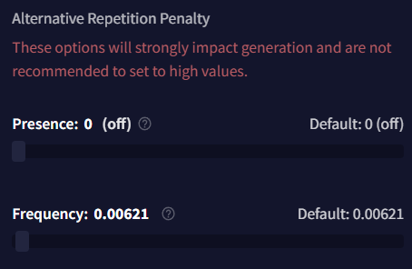

# Slider Settings
*Last contents updated 9/24/2024*

- [Config Preset](#config-preset)
- [Generation Options](#generation-options)
    - [Randomness](#randomness)
    - [Output Length](#output-length)
    - [Repetition Penalty](#repetition-penalty)
- [Sampling](#sampling)
    - [Mirostat](#mirostat)
    - [Nucleus](#nucleus)
    - [Tail Free](#tail-free)
    - [Top A](#top-a)
    - [Top K](#top-k)
    - [Typical](#typical)
    - [Unified](#unified)
    - [Sampling Order](#settings-order)
- [Repetition Penalty](#repetition-penalty-1)
- [Alternative Repetition Penalty](#alternative-repetition-penalty)

## Config Preset

상단의 **Config Preset** 드롭다운 메뉴는 사용자가 저장하거나 임포트한 모든 프리셋들이 표시되며, 그 아래에 NovelAI의 기본 프리셋들이 나열됩니다. 각 모델은 모델들이 가진 다양한 기본 프리셋이 딸려있으며 이들은 주로 창의적인 글쓰기를, 일부는 특정 글쓰기나 생성 스타일을 위해서 튜닝되었습니다. 드롭다운 메뉴 옆의 펜 아이콘은 선택한 프리셋의 이름을 변경하기 위한 것입니다.

**Import** 및 **Export** 버튼은 여러분의 프리셋을 공유하거나 다른 사람이 공유한 프리셋을 가져올 때 사용될 수 있으며 아래 세팅 중에 하나를 수정할 때마다 **Update active Preset** 팝업이 드롭다운 아래에 나타납니다. **Update active Preset** 드롭다운에서 현재 프리셋을 저장하고, **Reset Changes**를 통해 프리셋을 원래 설정으로 되돌리거나 새 프리셋에 현재 변경점을 저장할 수 있습니다!

## Generation Options

이 페이지의 **Generation Options** 섹션은 세가지의 기본 생성 세팅을 포함하고 있습니다: **Randomness**, **Output Length** 그리고 **Repetition Penalty**. 이 세팅들은 대부분 아래의 [Samplers](#sampling)의 어느 것도 조절할 필요 없이 그때그때 봐가면서 조절하기 명확하고 쉬운 것들 입니다.

### **Randomness**

AI 모델은 토큰에 대한 확률을 제공하지만, 토큰을 직접적으로 선택하지는 않습니다. 텍스트를 생성할 때, 우리는 **Probabilities**를 사용하여 토큰을 선택합니다. **Randomness**는 토큰이 선택될 확률에 변화를 줍니다. 가능성이 높은 토큰은 보통 더 적절하거나 '옳다'고 여겨지겠지만, 가장 가능성 높은 토큰만 선택된다면 생성된 텍스트는 반복적이고 지루해질 겁니다. **Randomness**와 아래의 [Samplers](#sampling) 같은 설정은 사용하기에 따라 선택될 수 있는 적거나 많은 다양한 토큰 토큰풀을 형성하여 균형을 맞추는 것에 도움을 줍니다.

**Randomness** = 1 은 토큰 확률이 텍스트의 일반적인 분포를 따른다는 것을 의미합니다. 이것이 기본 설정이며 **Randomness** 사용에 익숙하지 않다면 권장되는 선택이기도 합니다.

**Randomness** < 1 은 **가능성 높은 토큰의 가능성은 더 높아**지고, **가능성이 낮은 토큰은 더 낮아**지는 것을 의미합니다. 낮은 **Randomness**은 논리적인 토큰의 일관성을 높이지만, 반복성이 높아지고 창의력이 낮아진다는 단점이 있습니다. **Randomness**가 너무 낮으면, 생성된 텍스트는 반복에 빠지며 이것은 바람직하지 않습니다. 이것은 머신 러닝에서 자주 논의되는 주제입니다—각 토큰에 대해 확률이 높은 선택만 한다면 장기적으로 나쁜 결과물을 생성한다는 것입니다.

**Randomness** > 1 은 모든 토큰의 생성확률을 더 **같게** 만든다는 의미입니다. 높은 **Randomness**은 더 창의력을 주지만, 결과물에 논리적 오류나 오타 같은 실수를 증가시키는 단점을 낳습니다.

**Randomness**를 1과 가깝게 유지하는 것이 권장됩니다. 만약 **Randomness**가 1보다 높으면 [Samplers](#sampling)를 사용하여 낮은 확률의 토큰을 삭제하는데 도움을 얻을 수 있습니다.

예를 들어, 만약 위 이미지를 프롬프트로 사용하고 생성될 토큰의 [확률](./editor.md#token-probabilities)을 보면...

<table style="border: 1px solid">
<tr>
<td>

</td>
<td>

</td>
</tr>
<tr>
<td>
Randomness 1.0 
</td>
<td>
Randomness 1.25 
</td>
</tr>
</table>

이 페이지는 가장 높은 토큰을 보여줍니다. 오른쪽의 **Randomness** 1.25는 **after** 토큰 확률이, 특히 제일 높은 토큰의 확률이 더욱 낮아진 것을 볼 수 있습니다. 높은 **Randomness**는 텍스트가 생성될 때 모든 토큰에게 더 동등한 기회를 주기 때문이며, 위의 페이지에는 확률이 높은 토큰만 나타나기 때문에 거의 모든 **after** 토큰의 확률이 낮아진 것처럼 보이기 때문입니다. 위 페이지에는 나타나지 않은 낮은 확률의 토큰의 **after** 확률은 올라갑니다. 높은 **Randomness**는 토큰들의 확률을 더욱 같게 만들지만 토큰들의 순서는 바꾸지 않습니다.

### **Output Length**
**Output Length**는 AI가 출력당 생성할 수 있는 텍스트 문자의 최대량을 조절합니다. 구독 티어에 따라 최소 4자에서 최대 600자까지입니다. AI 생성의 특성 때문에 긴 출력길이는 품질이 달라질 수 있으니 주의해야 하며, 짧은 출력 길이가 주제를 더 잘 유지하는 경향이 있습니다.

### **Repetition Penalty**
**Repetition Penalty** 슬라이더는 **context**에서 토큰이 나타날 **확률**에 패널티를 적용하며, 여러번 나타나는 것에는 더 심한 패널티를 부과합니다. 해당 값이 높다면 더욱 심한 패널티를 적용하므로 이 슬라이더를 너무 높이면 출력이 저하되거나 다른 의도치않은 동작을 발생할 수 있습니다. 반면에 너무 낮은 세팅 값에서는 AI가 계속 같은 단어나 구두점을 반복할 수 있습니다. 해당 세팅을 살짝 조절하여 스토리의 페이스나 포커스에 대해 안내하는데 도움이 될 수도 있습니다. 예를 들어, 만약 AI가 특정 캐릭터의 이름이나 세부 사항을 더욱 자주 언급하게 하고 싶다면 해당 슬라이더를 낮추고, 더 다양한 단어 선택을 사용하게 하고 싶다면 이 슬라이더를 높이십시오.

## Sampling

샘플러의 목표는 토큰의 다양성을 유지하면서 가장 낮은 확률의 토큰을 제거하는 것입니다. **Randomness** 혼자만으로는 달성할 수 없죠. 낮은 **Randomness** 값은 가장 낮은 확률의 토큰을 제거하지만, 가장 높은 확률의 토큰만을 선택할 것이기 때문입니다. 샘플러는 이 간격을 제거하는데 사용됩니다. **Unified**, **Min P**, **Nucleus**을 사용해보는 것을 추천합니다. [여기](./sampling_guide.md)에 더 자세한 가이드가 있습니다.

### Min P

**Min P**는 가장 가능성이 높은 토큰의 확률에 이 슬라이더의 값을 곱하고, 이 임계값 이하의 토큰은 삭제합니다. 예를 들어, 가장 높은 확률이 0.6이고 Min P 값을 0.1로 설정하면, 확률이 0.06 이하인 토큰은 0으로 설정됩니다.

### Mirostat

**Mirostat**에는 **Tau**와 **Learning Rate**라는 두개의 슬라이더가 있습니다. 이 샘플러는 **Tau** 값으로 지정된 주어진 복잡도로 텍스트를 유지하려고 시도하며, 세팅이 높을수록 더욱 복잡한 텍스트를 제공하려고 시도합니다. **Learning Rate** 슬라이더는 샘플러가 **컨텍스트**에 얼마나 빠르게 적응할지를 지정합니다. 1로 설정하면 즉각적이고, 낮은 세팅일수록 완화됩니다. 이 샘플러를 다른 샘플러와 함께 사용하는 것은 권장되지 않습니다.

### Nucleus

**Nucleus** 샘플링은 **Top-P**라고도 하며, 토큰을 가장 높은 확률에서 낮은 순서로 정렬하고 낮은 확률의 토큰을 제거합니다. 삭제 기준은 **남은 토큰들의 확률 총합이 슬라이더에서 설정한 값과 같아**질 때까지 입니다. **Nucleus** 샘플링은 출력물의 일관성을 높이지만, **낮은** 확률의 토큰은 이 과정에서 손실되어 창의력이 희생됩니다. 해당 슬라이더를 **낮게** 설정할 경우 더 많은 토큰이 사라지므로, 해당 값을 실험할 때는 조금만 조정하는 것을 추천합니다.

### Tail Free

**Top K**와 **Nucleus** 샘플링을 대체하기 위해 고안된 **Tail Free**은 출력의 확률의 '꼬리'를 계산하기 위해 수학 공식을 사용합니다. 꼬리, 그리고 **Tail Free** 샘플러에 대한 자세한 설명은 [이](https://www.trentonbricken.com/Tail-Free-Sampling/) 블로그 게시글에서 자세히 설명되어 있습니다. 이 샘플러는 가장 낮은 확률의 임계점을 출력 확률 분포의 '**꼬리**'로 결정한 다음 이를 제거합니다. 이렇게 제거된 후에 살아남은 토큰들은 보상을 위해 확률을 재조정합니다.

간단하게 말해, 이 세팅은 출력의 [Logical Probabilities](./editor.md#token-probabilities) 하단에서 수식*formula*이 최악의 가능성의 토큰으로 간주한 것의 일부를 잘라내는데 도움을 줍니다. 이 슬라이더를 조절할 때는 조금만 조정하는 것을 추천합니다. **Tail-Free**를 0에 가깝게 설정할수록 **최악**의 토큰으로 간주되는 임계점이 더 커지고 강해지기 때문입니다.

### Top A

**Top-A**은 `(maximum token probability)^2 * A` 보다 낮은 확률을 갖는 모든 토큰을 제거합니다. 기본적으로 토큰의 확률이 최상위 토큰의 확률보다 훨씬 작으면 삭제됩니다. Top-A 값이 **높을** 수록 엄격해지며 많은 토큰이 잘립니다.

### Top K

**Top-K**를 사용하면 유지할 토큰의 갯수를 선택하고 나머지는 삭제됩니다. 예를 들어, **Top K**가 10으로 설정되어 있다면, 이 샘플러는 최상위 10개의 토큰을 제외한 모든 토큰을 제거합니다.

>  **Goose tip:**
**Top K**을 1로 설정하면 생성을 다시 시도할 때마다 **같은** 토큰을 얻게 되요! 텍스트 품질을 높이지는 않지만 테스트할 때는 유용할 수 있죠.

### Typical

**Typical** 샘플링은 약간 더 복잡한 옵션 중에 하나입니다. 생성된 각 출력 토큰에 대해, 엔트로피 계산을 통해 "예상되는 토큰의 확률"을 추정합니다. 예상된 확률보다 토큰의 확률이 너무 크거나 낮으면 해당 토큰은 삭제됩니다. **Typical** 설정은 유지할 토큰의 비율을 결정합니다. 1은 모든 토큰을 유지하고, 0은 모든 토큰을 삭제합니다. 해당 샘플러는 비정상적으로 높은 확률의 토큰을 삭제한다는 것을 명심하세요. 다양하고 다채로운 생성을 하겠지만, 출력물의 품질이 낮을 수도 있습니다.

### Unified
**Unified** 샘플링은 세가지의 패러미터를 갖는다: **Linear**, **Quad**, **Conf**. **Linear**는 [1/Randomness](#randomness)와 같고 값이 높을수록 높은 확률을 증시키고, 낮은 확률을 낮춥니다. **Quad** 낮은 확률을 더 작게 만듭니다: 확률이 낮을수록, 그것의 확률을 더 낮출 것입니다. **Conf** 상위 확률들이 모두 작다면 **Linear**를 늘리지만, 확률이 하나 혹은 두개의 토큰에 집중되어 있다면 효과가 없습니다. 공식은 `output log-probability = (input log-probability) * (Linear + Entropy * Conf) - (input log-probability)^2 * Quad` 입니다.

### Settings Order

**Order Settings** 창을 통해 **샘플러**의 순서를 바꿀 수 있습니다. 샘플러는 위에서부터 아래로 적용됩니다. 화살표 버튼을 사용하거나 개별 박스를 드래그하여 샘플러 순서를 바꾸고 오른쪽의 버튼을 눌러 토글하십시오. Temperature(Randomness)는 비활성화**할 수 없습니다.**

샘플러는 적용하는 순서는 예상할 수 없는 효과를 일으킬 수 있으므로 기본 구성 프리셋으로 시작하여 실험을 해보십시오.

## Repetition Penalty

**Repetition** 섹션과 아래의 [Alternative Repetition Penalty](#alternative-repetition-penalty) 옵션들은 모두 글 생성을 덜 반복적으로 만들기 위한 것입니다.

- **Phrase Repetition Penalty**

더 자세한 설명을 위해 [Advanced: Phrase Repetition Penalty](./advanced_phrase_repetition_penalty.md)을 참조하십시오.

- **Use Default Whitelist**

화이트리스트 토큰의 전체 리스트를 보려면 [Repetition Penalty Whitelist](https://docs.novelai.net/text/reppenwhitelist.html)를 참조하십시오.

- **Range**

**Repetition Penalty Range**는 **Story Context**의 아래부터 시작해서 몇 개의 토큰에 **Repetition Penalty** 설정이 적용될 것인지를 나타냅니다. 이 값을 최소치인 0(off)로 설정하면, 반복 패널티는 출력 전체에 걸쳐 적용되며, 이는 슬라이더를 **Subscription Tier**의 최대로 설정한 것과 같습니다. 이 슬라이더는 **Dynamic Range**가 비활성화된 경우에만 작동합니다.

- **Slope**

**Slope** 슬라이더는 컨텍스트의 가장 최근 토큰과의 거리에 따라, 설정한 **Repetition Penalties**(**Phrase Repetition Penalty**는 **제외**)의 몇퍼센트를 컨텍스트의 토큰에 적용할 지를 지정합니다. 비활성화되면 기울기가 적용되지 않으며 모든 패널티가 평범하게 적용됩니다.

**Slope**가 1과 **같거나** 1보다 **작은** 값으로 설정된다면, **마지막** 토큰만 100%의 패널티 값을 받고, 이전 토큰들은 **줄어든** 패널티 퍼센트를 겪게 됩니다. 이 감소는 **Slope**를 0에 가깝게 설정할 수록 완만하고 점진적이 됩니다. 값을 정확하게 1로 설정하면, 각 토큰에 대한 퍼센트 감소는 **동일**한 양이 되고 기울기가 곧은 상향선이 됩니다.

만약 값이 1보다 **크다면**, **Slope**는 직선에서 계단 모양으로 바뀌고, **Slope** 값이 최대값인 10에 가까워질수록 *더* 강렬*intense*해집니다. 이 범위에서, 가장 최근의 여러 토큰이 100%의 패널티 값을 받을 수 있지만, 이전 토큰은 갑자기 패널티 비율이 크게 감소하는 "절벽"이 형성됩니다. **Slope**가 10이면, 컨텍스트의 절반은 100%의 패널티 값을 받는 반면, 나머지 절반은 패널티를 전혀 받지 않습니다.

- **Dynamic Range**

해당 값이 활성화되면 **Dynamic Range** 토글은 **Repetition Penalty** 설정을 **Story** 텍스트에만 적용되도록 만듭니다. 즉, **Memory**, **Author's Note**, **Lorebook** 텍스트 내에는 적용되지 않음을 의미합니다. 이것을 활성화하면 AI는 해당 세션에서 언급된 설명 등을 더 자주 언급할 수 있으며 **Range** 슬라이더가 조절되는 것을 방지할 수 있습니다.

## Alternative Repetition Penalty

**Alternative Repetition Penalty** 섹션의 이 설정은 매우 고급 기능입니다. 아주 약간 슬라이더를 조절해도 AI에 커다란 영향을 줄 수 있으며, 너무 많은 토큰을 잘라내어 자주 헛소리하는 결과가 나올 것입니다. 이 값을 실험할 때는 매우 작은 조정만을 사용하고, **범위** 설정을 조심하십시오.

- **Presence**

**Presence** 패널티는 기본 **Repetition Penalty**와 비슷하게 동작하지만, 토큰이 얼마나 자주 나타나는지 조정하는 것보다는 토큰이 나타날 때마다 일정한*flat* 패널티를 적용합니다. **Presence** 패널티를 실험할 때는 매우 작은 조정만을 하는 걸 추천하는데, 이 값을 너무 높게 설정할 경우 구두점 토큰이 빠르게 패널티를 받아 생성되지 않을 수 있습니다.

- **Frequency**

**Frequency** 패널티는 얼마나 자주 토큰이 나타나는지에 따라 적용되며, 더 일반적인 토큰에는 패널티를 부과하고 덜 일반적인 토큰에는 덜 부과합니다. 만약 이 값이 너무 높다면, **Frequency**는 빠르게 출력의 품질을 저하시킬 수 있으므로, 이것을 실험할 때는 매우 작은 조정만을 해야 합니다. 
