# Story Settings

옵션 사이드바의 첫번째 탭인 **Story** 탭은 NovelAI 모험을 시작하는 첫 번째 단계라고 할 수 있습니다. 이 곳에서, 사용하길 원하는 **AI Model**을 선택하고 **Config Preset**을 고르고, **Memory**와 **Author's Note** 정보를 채우는 등의 일을 할 수 있습니다! [Editor](./editor.md) 오른쪽 사이드의 편리한 위치에 있는 이 곳에서 **Lorebook Quick Access** 바에서 로어북 엔트리들을 빠르게 검색하고, 스토리 통계를 보고, 스토리 파일을 추출하거나 지우는 이 모든 작업을 할 수 있습니다.

## AI Model

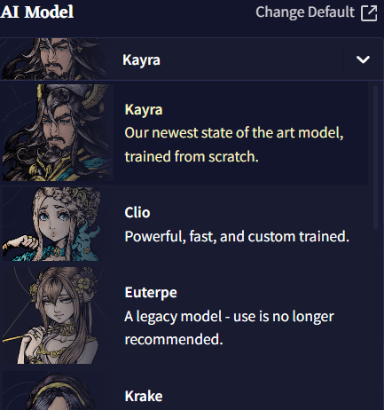

**Story** 탭 오른쪽 최상단의 AI Model 셀렉터에서, 파인튜닝되고 실험적인 모델을 선택할 수 있습니다!

**Change Default** 버튼을 클릭하면 [AI Settings](./ai_settings.md) 메뉴로 들어갈 수 있고, 그곳에서 기본 스토리 모델과 프리셋, 모듈을 포함하여 **Lorebook** 생성에 사용할 모델을 선택할 수 있습니다. **AI Settings** 메뉴에서 선택한 기본 세팅은 새 스토리를 만들 때 적용됩니다.

>  **Goose tip:**
기본 세팅을 자주 확인하세요. 새로운 AI 모델과 기능이 출시되면 이 메뉴에서 설정할 수 있어요!

## AI Module

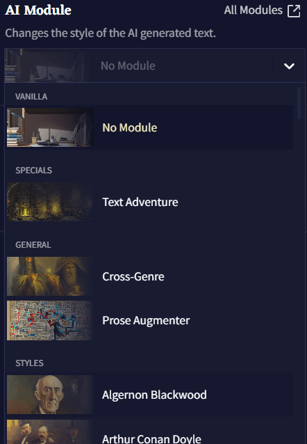

**AI Modules**은 AI를 원하는 장르, 설정, 혹은 월드에 집중시키게 하는 강력한 도구입니다. 영향력 있는 작가나 문체에 초점을 맞추거나 특정한 주제 혹은 텍스트 어드벤쳐 등이 될 수 있습니다. 60가지가 넘는 다양한 모듈을 선택 가능하기 때문에 그 가능성은 무궁무진합니다! **All Modules** 버튼을 클릭하면 사용자가 임포트한 사용자 모듈을 포함하여 설명과 함께 모든 모듈의 라이브러리를 확인할 수 있습니다! 또한 이 메뉴의 드롭다운 메뉴를 통해 모델을 삭제할 수도 있습니다.
[Special AI Modules](./advanced_special_modules.md) 섹션을 클릭하여 Clio나 Kayra 모듈에 관한 자세한 정보를 얻고, [Modules](./module_training.md) 섹션에서 구모델들을 확인하세요.

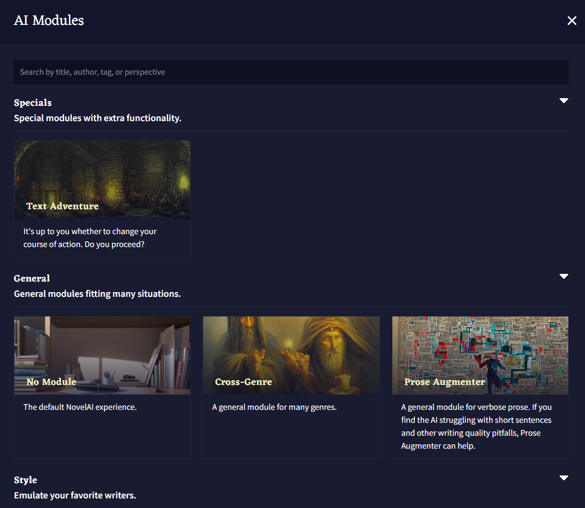

## Config Preset

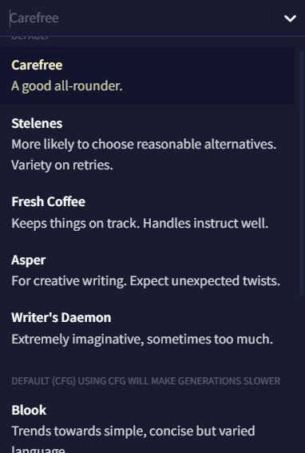

**Config Preset** 드롭다운에는 저장 및 임포트된 사용자 프리셋과 각 모델에 맞는 권장 기본 값이 있습니다! **Edit preset** 버튼을 클릭하면 **Config Settings** 탭으로 갈 수 있고 이곳에서 **AI Generation Settings**을 조절할 수 있습니다.

>  **Goose tip:**
AI가 이야기 흐름에서 벗어나거나, 말이 안되는 소리를 하거나 같은 말을 반복하는 경우에 프리셋을 바꾸면 AI를 다시 원래대로 회복시킬 수 있을지도 몰라요!

## Memory

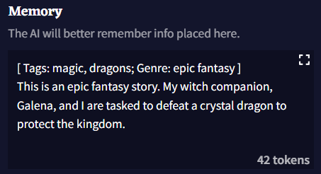

**Memory Box**를 통해 AI가 기억했으면 하는 정보를 저장할 수 있습니다. 현재 설정, 캐릭터, 동료들 및 스토리에서 일어났던 일과 관련된 넓은 범위의 세부 정보를 여기에 저장하십시오. 이야기에서 중요한 요소가 발생할 때마다 Memory Box 필드에 업데이트하면 AI가 일관성을 유지하는데 더욱 도움이 됩니다!

기본적으로, **Memory**에 입력된 정보는 [Story Context](./advanced_settings.md#context) 최상단에 배치됩니다.

>  **Goose tip:**
Memory Box는 당신이 원하는 거의 모든 방식으로 사용할 수 있고, 사용하고 싶지 않다면 그래도 됩니다! 실험을 해보고 자신에게 가장 맞는 것이 무엇인지 확인하세요!

## Author's Note

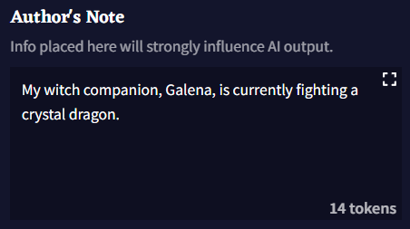

**Author's Note** 박스에 입력되는 정보는 AI가 [Story Context](./advanced_settings.md#context)에서 보는 것들 중에서 가장 최신의 텍스트 중 하나입니다. **Author's Note**는 기본적으로 [Memory](#memory)보다 더 최근의 컨텍스트에 삽입되므로 메모리의 더 강력한 버전처럼 작동합니다! 약간의 짧은 문장을 넣어서 '일어났으면' 하고 바라는 이야기, AI가 더 집중해줬으면 하는 이야기의 디테일, 원하는 방향으로 AI가 출력물을 생성할 수 있게 은근슬쩍 쿡 찔러볼 수 있는 모든 것을 설명하고 사용할 수 있습니다. Author's Note 박스에 입력되는 모든 것은 AI에 강한 영향력을 미치므로 이 박스를 부지런히 업데이트하십시오.

## Lorebook Quick Access

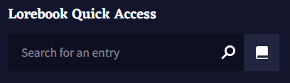

**Lorebook Quick Access** 검색바는 로어북을 열지 않고도 스토리 탭에서 바로 로어북 엔트리를 빠르게 검색하고, 보고, 수정할 수 있게 해줍니다. Lorebook Quick Access 검색바를 통해 **Editor** 화면을 가리지 않고 로어북 엔트리를 수정하거나 정보를 더블 체크할 수 있습니다.

## Story Options

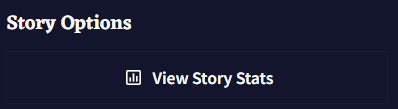

**View Story Stats** 버튼을 눌러 스토리에 관한 기술적 정보가 가득 담긴 창을 열 수 있습니다. 여기에는 스토리를 빠르게 다듬거나 스토리의 서식을 지정할 수 있는 **Experimental Options**도 있습니다!

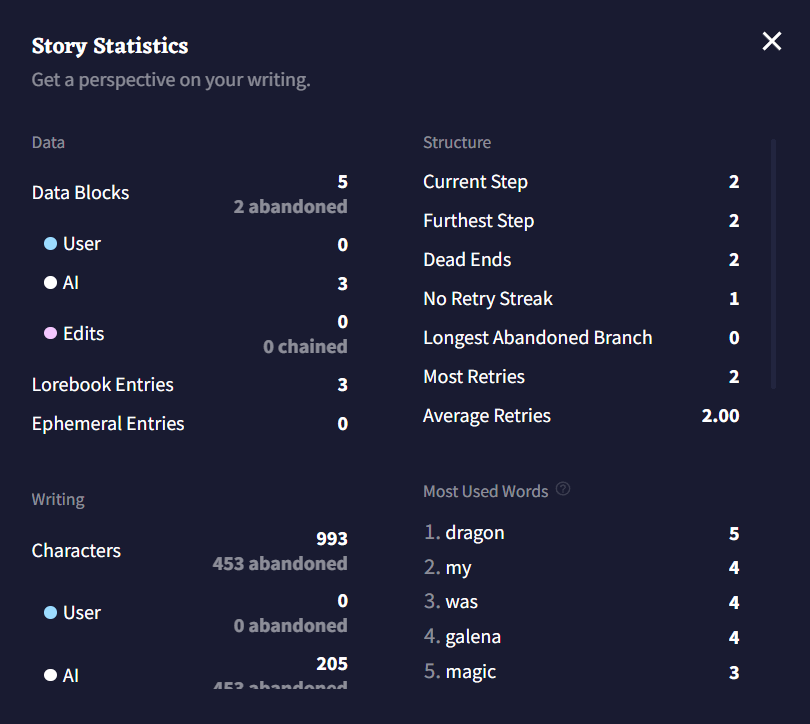

AI 출력, 유저 입력, 수정된 텍스트의 각 비트는 **Data Block**으로 계산됩니다; **Data Block**의 총 수와 Data Block의 출처에 대한 분석은 통계창 상단에서 확인할 수 있습니다. 각각의 출력은 **Step**으로 계산되며 **Dead End**는 실행취소되거나 리트라이된 브랜치를 수동으로 삭제할 때마다 수치가 올라갑니다. 개별 텍스트 글자의 수와 **Most Used Words** 또한 창 상단에서 확인할 수 있습니다.

**Generate Additional Stats** 버튼을 클릭하면 현재 이야기의 단어 수, 문단 수, 문자의 수가 최빈단어 상위 10개와 같이 표시됩니다.

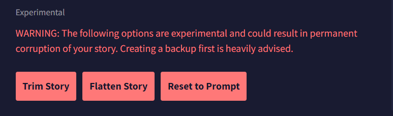

- **Trim Story**

**Trim Story** 버튼을 누르면 [Story Context](./advanced_settings.md#context)와 현재 [Editor](./editor.md) 창에 나타나는 스토리만 남기고, 실행취소/다시실행/리트라이의 브랜치가 삭제됩니다. `.story` 파일에 이야기를 저장할 때, 결과물에 같이 저장되길 원하지 않는 브랜치들을 잘라내고 싶을 때 사용하십시오.

- **Flatten Story**

**Flatten Story** 버튼은 스토리에 있는 모든 실행취소/다시실행 히스토리와 브랜치를 삭제하여 현재 진행되고 있는 스토리의 텍스트를 시작 프롬프트로 취급합니다.

- **Reset to Prompt**

**Reset to Prompt** 버튼은 에디터의 모든 것을 잘라내어 시작 프롬프트로 입력한 내용으로 되돌아갑니다. 이야기의 모든 브랜치와 히스토리 역시 삭제됩니다.

## Remote Storage

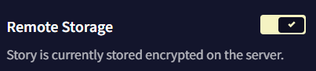

**Remote Storage** 토글을 켜면 로컬에 작성한 스토리를 NovelAI의 서버에 저장하게 할 수 있습니다. 이 토글을 사용하여 다른 브라우저나 모바일, PC와 같이 서로 다른 플랫폼 사이에서 이야기를 전달하십시오!

>  **Goose tip:**
원격으로 저장된 모든 이야기는 모두 암호화되며 사용자의 계정에서만 접근가능해요! 만일에 사태에 대비하여 **Remote Storage**를 활성화하는 것을 추천해요. 후회하는 것보다 안전한 것이 낫죠!

## Export Story

NovelAI 이야기를 로컬에 저장하거나 다른 사람과 공유할 수 있는 등 다양한 방법으로 이야기를 내보낼 수 있습니다! 다른 사람들과 이야기를 공유하고 싶습니까? **As Scenario** 옵션을 클릭하여 커스텀된 `.scenario` 파일을 만들어서 쉽게 공유하십시오. **As Image** 버튼을 클릭하여 커스텀된 `.jpg`나 `.png` 스크린샷으로 이야기를 저장할 수도 있습니다!

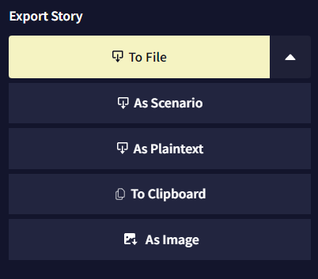

- **To File**

**To File** 버튼을 눌러 이야기를 `.story` 파일로 저장할 수 있습니다. 여기에는 현재 모든 이야기 브랜치와 히스토리가 포함됩니다. 만약 `.story` 파일로 이야기를 공유한다면 모든 실행취소와 리트라이도 보이게 됩니다!

- **As Scenario**

**As Scenario** 버튼을 눌러 이야기를 공유하면 `.scenario`라는 고유한 파일로 이야기가 저장됩니다. `.scenario` 파일을 NovelAI로 임포트하면 항상 대화상자가 열리므로, 태그를 설정하고 간단한 설정과 함께 유저 커스텀이 가능한 스토리를 만들기 위한 사용자 정의 플레이스 홀더를 포함할 수 있습니다!

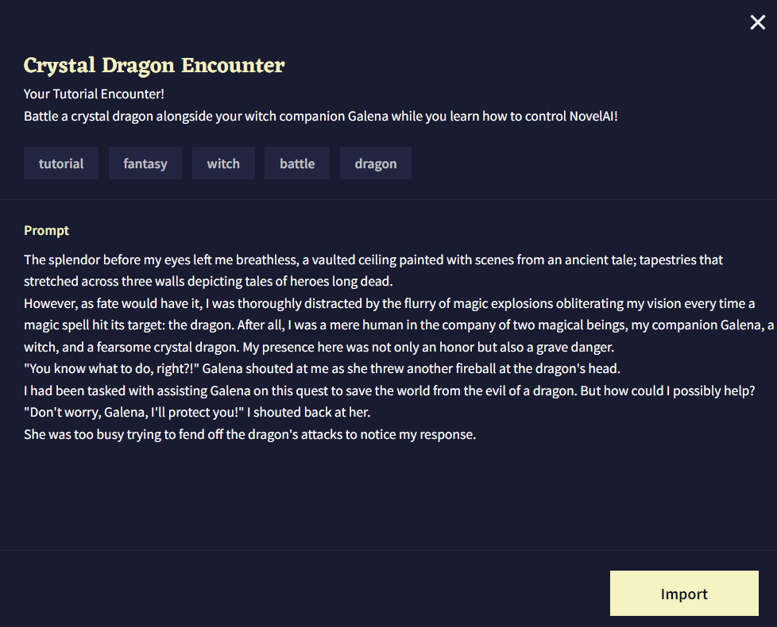

- **As Plaintext**

**As Plaintext** 옵션을 사용하여 이야기를 `.txt` 파일로 내보낼 수 있습니다. 이 옵션은 이야기 텍스트만을 저장하지만 다른 기기나 에디터에서 쉽게 볼 수 있습니다.

- **To Clipboard**

**To Clipboard** 옵션은 전체 이야기를 클립보드로 보냅니다. 그러나 **As Plaintext** 옵션과는 달리 To Clipboard는 추가적인 이야기 데이터를 같이 전달합니다. 이야기가 큰 경우에는 옵션 실행이 약간 느릴 수도 있습니다.

- **As Image**

**As Image** 버튼을 클릭하면 **Screenshot Designer**라는, 이야기를 예쁘게 꾸밀 수 있는 개인화된 스크린샷을 만들 수 있는 인터페이스가 열립니다! 이 이미지는 임포트할 수는 없지만 당신의 스토리 제작 기술과 인상적인 AI 출력물을 자랑할 수 있는 좋은 방법입니다.

>  **Goose tip:**
텍스트를 강조표시한 후, 에디터에서 마우스 오른쪽 버튼을 클릭하여 Screenshot Designer에 들어가서 스크린샷을 찍을 수도 있어요!

## Delete Story

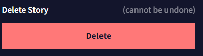

**Delete Story** 버튼을 누르면 이야기가 삭제됩니다. 삭제된 이야기는 복구할 수 없으므로 팝업 창에서 삭제버튼을 누르기 전에 정말로 이야기를 삭제하고 싶은지 확인하세요!

