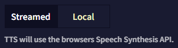
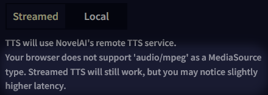
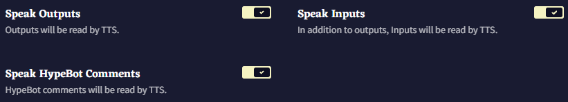
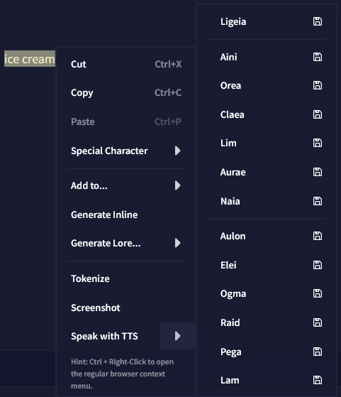
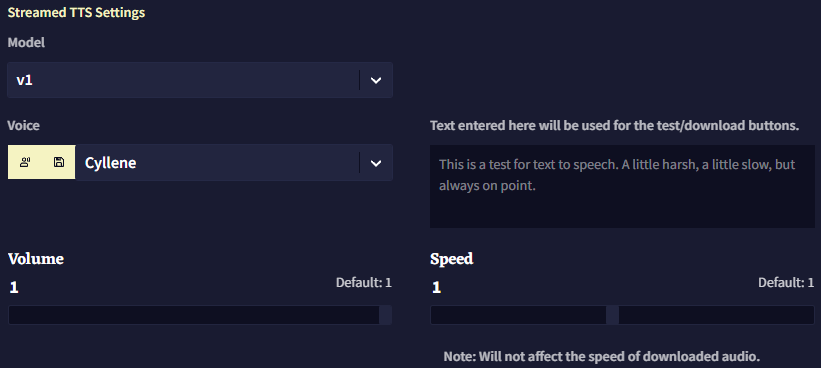
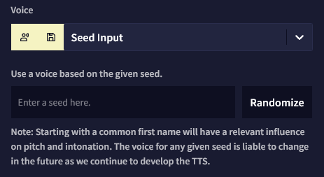
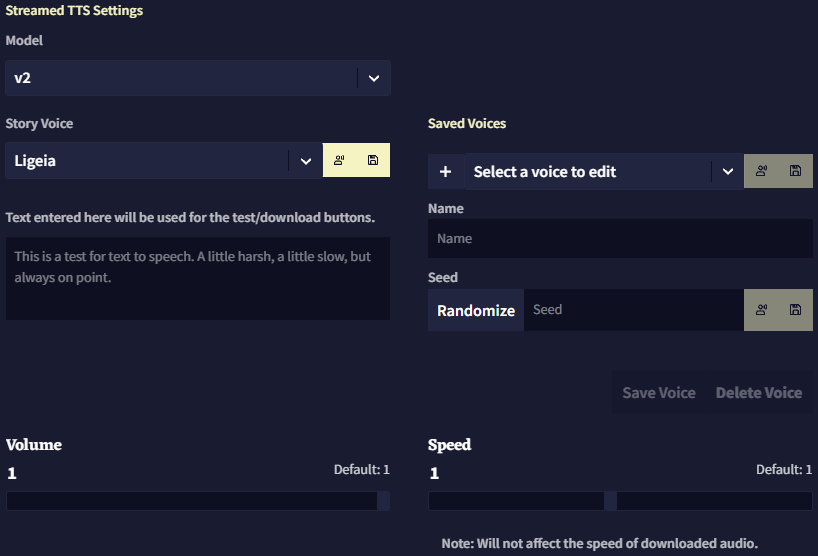
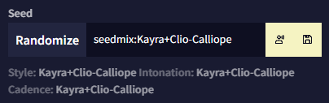
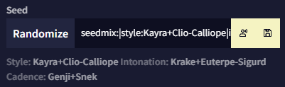
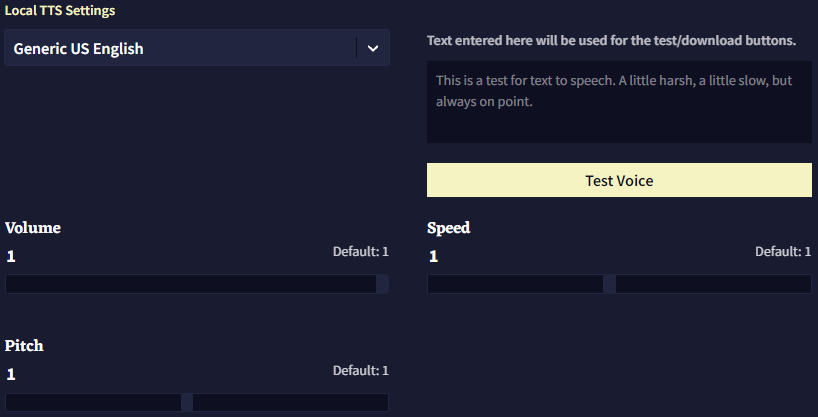

# Text To Speech

**Text to Speech (TTS)** 탭을 통해 로컬 TTS와 NovelAI의 스트리밍 TTS 기술을 설정하고 사용하여 사용자가 작성한 텍스트를 음성으로 읽게 할 수 있습니다.

## Text to Speech Source

가장 먼저해야 할 일은 **Streamed**를 사용 할지, **Local** TTS를 사용 할지를 고르는 것입니다.

**Streamed:** 음성 대사*line*를 생성하기 위해 NovelAI의 원격 TTS 서비스를 사용합니다. 이 옵션은 더 나은 품질과 커스터마이징된 기능을 제공하지만 유료 구독을 활성화해야 합니다(무료 트라이얼에서는 100개의 음성 대사*line* 생성이 제공됨).

**Local:** 브라우저의 텍스트 합성 기능을 사용합니다. 사용하는 로컬 TTS 도구에 따라 품질이 달라지며 NovelAI의 TTS 모델 기능은 사용할 수 없습니다.

*Streamed TTS에 관한 참고사항: 일부 인터넷 브라우저에는 가능한 빨리 재생할 수 있는 기능이 없습니다. 그러므로 브라우저에 따라서, 음성 대사가 약간 늦게 생성될 수도 었습니다. 해당 문제는 Streamed TTS를 선택할 때 아래와 같은 경고가 표시되는 것을 통해 알 수 있습니다.*

## Automatic Speech Options

다음으로, NovelAI가 특정 텍스트에 대해 언제 자동으로 TTS를 활성화할 것인지를 선택할 수 있습니다.

**Speak Outputs:** 이 옵션을 활성화하면 사용자가 **Send**를 클릭할 때, AI는 항상 텍스트에 대한 음성을 생성합니다.

**Speak Inputs:** 이 옵션을 활성화하면 사용자가 **Send**를 클릭할 때, AI는 생성되는 출력 앞에 사용자가 작성한 **새 입력**(기본 테마에서 *파란색 텍스트*)에 대한 음성도 생성합니다. **Speak Outputs**이 비활성화되어 있다면 아무런 효과가 없습니다.

**Speak HypeBot Comments:** 이 옵션을 활성화하면 **Hypebot** 코멘트가 생성된 뒤에 **Hypebot** 코멘트의 음성이 생성됩니다.

**여러** 자동 음성 옵션을 선택하면, 가장 먼저 사용자의 **입력**을 읽고 그 후에 AI의 **출력**을, 그리고 Hypebot의 **코멘트**를 읽습니다.

[Editor](./editor.md)에서 마우스 오른쪽 버튼을 클릭하여 필요할 때 원하는 텍스트에 대한 TTS를 생성할 수도 있습니다.

이 옵션을 클릭하여 기본적으로 설정된 음성 대사를 바로 생성하거나, 화살표를 클릭하여 다른 모든 목소리를 사용할 수도 있습니다.  **아이콘**을 클릭하면 해당 음성 대사를 재생하는 것 대신, 음성을 파일로 다운로드할 수 있습니다.

## Streamed TTS Settings

### Model

**Streamed TTS**에는 TTS **v1**과 TTS **v2**, 이렇게 두 개의 옵션이 있습니다. TTS **v1**은 TTS **v2**에 비해 약간 구형이고 기능은 적습니다만 간단합니다. *음성 사운드를 더 세밀하게 조절하고 싶다면, **v2**를 권장합니다.*

v1과 v2 모두  **버튼**을 눌러 선택한 음성을 즉시 재생할 수 있으며,  **버튼**을 누르면 음성 대사가 담긴 사운드 파일을 다운로드할 수 있습니다.

### v1 Settings

**v1**의 경우 기본 음성 중에 하나를 선택하거나 커스텀 **seed**를 넣을 수 있습니다. 오른쪽의 텍스트 필드를 사용하여 음성을 테스트할 텍스트를 입력할 수 있습니다.

드롭다운 리스트에서 가장 마지막 음성 옵션인 **'Custom Seed'** 를 선택하면, 기본 음성 대신 다른 음성을 사용하기 위한 문자열을 입력할 수 있습니다. **Randomize** 버튼을 클릭하면 임의의 seed가 입력됩니다. 보통의 이름*first name*을 사용하면 TTS AI의 음높이와 억양에 확연하게 영향을 미치는 경향이 있습니다. 예를 들어, seed에 `Maria`라고 입력하면 여성스러운 목소리가 나옵니다.

마지막의 슬라이더를 각각 조절하여 음성 대사를 읽는 **Volume**과 **Speed**를 변경할 수 있습니다. ***Volume** 설정은 기본적으로 최대로 설정되어 있으며 **Speed** 설정은 다운로드된 사운드 파일에는 영향을 미치지 않는다는 사실을 염두에 두십시오.*

### v2 Settings

**v2**는 더 최신의 강력한 TTS AI이기 때문에 둘러볼 수 있는 더 많은 옵션과 기능이 있습니다.

v1과 차별화되는 첫번째 기능은 더 크고 더 많은 기본 목소리 라이브러리가 있다는 것 외에도, seed를 사용하여 "제작"한 새 목소리를 *"custom default"* 로 저장하여 나중에 쉽게 선택하고 수정할 수 있다는 것입니다.

게다가 **v2**는 더욱 심층적인 *seed 시스템*이 있어, 특수한 *seed 구문*을 사용하여 다양한 seed들을 믹스 앤 매치하여 원하는 최종 목소리를 더욱 세밀하게 조절할 수 있습니다.

#### Seedmixing

문자열 `seedmix:`로 seed를 시작하면 `+` 기호를 사용하여 하나 이상의 시드를 결합하거나, `-` 기호를 사용하여 하나 이상의 시드를 기반으로 하는 최종 결과에 대한 네거티브 효과를 적용할 수 있습니다.

예를 들어, 남성적인 사운드의 Kayra와 여성적인 사운드의 Clio의 seed를 섞되, 음수의 Calliope를 믹스에 적용하여 목소리에 여성적 요소의 일부를 빼고 싶다면 다음처럼 seed를 작성할 수 있습니다: `seedmix:Kayra+Clio-Calliope`

선택된 seed 아래에서 **Style**, **Intonation**와 **Cadence** 텍스트를 확인하세요. 실제로 TTS **v2** 음성은 이 세가지의 개별 매개변수로 구성되며, 각각 *다른 seed*를 사용할 수 있기 때문에 이러한 란이 있습니다.

**Style:** 목소리의 전반적인 톤에 영향을 미칩니다만, 상대적으로 미묘한 효과를 갖는 경형이 있습니다. 가장 쉽게 눈치챌 수 있는 효과는, seed에 따라서 최종 음성이 약간 더 깊거나 높게 들린다는 것입니다.

**Intonation:** 목소리 자체의 소리를 결정합니다. *intonation seed* 가 다르면 *다른 사람*이 말하는 것처럼 들리므로, 이 매개변수는 최종 결과물의 소리에 가장 큰 영향을 줍니다.

**Cadence:** 특정 음소를 얼마나 빠르게 혹은 느리게 읽을지를 조정하여 목소리가 단어들을 강조하는 방식을 변경합니다. 질문이나 감탄사에서 그 효과를 알아차리기 쉽습니다.

그리고 앞서 언급한 것처럼, 특수한 구문을 사용하여 각각의 매개변수에 개별 seed를 사용할 수 있습니다. `|` (pipe) 문자를 사용하여 이것들을 구분하기만 하면 됩니다.

기본적으로 `|style:`, `|intonation:`, `|cadence:` 문자열을 다른 seed 조합과 함께 **seedmix**에 추가하여, 사용자가 각 매개변수에 대해 다른 seed를 원한다는 것을 나타낼 수 있습니다.

예를 들어 다음과 같이 각각의 매개변수를 개별적으로 고려하는 **seedmix**를 설정할 수 있습니다: `seedmix:|style:Kayra+Clio-Calliope|intonation:Krake+Euterpe-Sigurd|cadence:Genji+Snek`

결과물은 다음과 같습니다:

***seedmix** 구문에 대해 참고할 사항: TTS seed는 일반적으로 빈 공백을 넣어도 되지만, seedmix는 빈 공백을 넣어서는 안됩니다. 차후 seed에 seedmix를 사용하게 될 수도 있으므로, 단일 seed에서도 빈 공백을 두는 것은 추천하지 않습니다.*

마지막으로 **v2**도 역시 **Volume**과 **Speed** 슬라이더가 있고, *v1과 같은 제약사항이 적용됩니다.*

>  **Goose tip:**
**seedmix**의 *합*이 0이나 음수가 되지 않도록 주의하세요! 예시: `seedmix:Goose-Goose`
> 
> 소리가 좋지 **못** 할 거에요!

## Local TTS Settings

**Local TTS**는 Streamed TTS에 비해서 커스텀할 수 있는 것이 그렇게 많지는 않습니다.

할 수 있는 것은 사용할 **Local** 음성을 선택하고, 브라우저에서 테스트하고 슬라이더를 조절하는 것 뿐입니다.

**Local TTS**에도 고유한 **Pitch** 슬라이더가 있습니다만, ***Local TTS**에서는 음성 파일을 다운로드할 수 없습니다.*