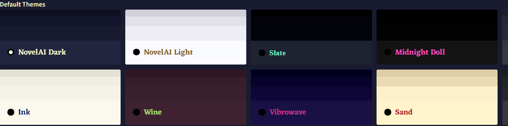
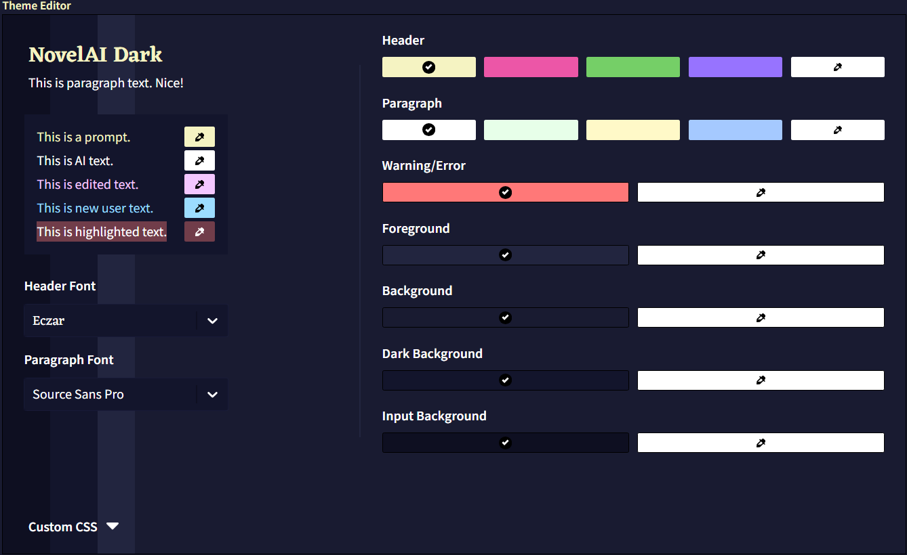
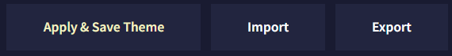
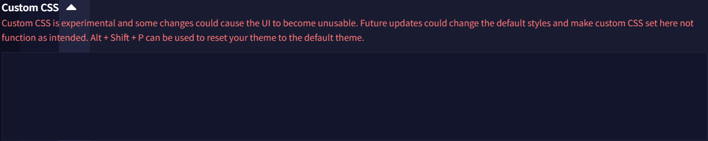
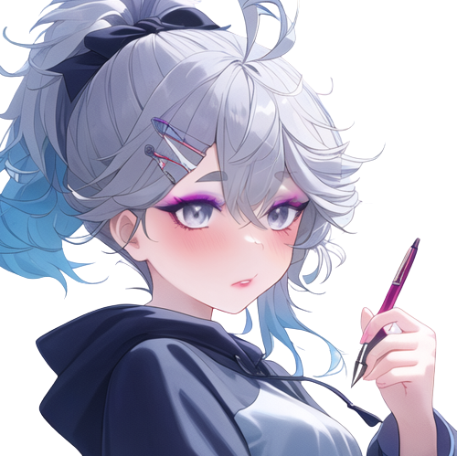
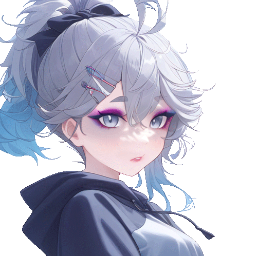
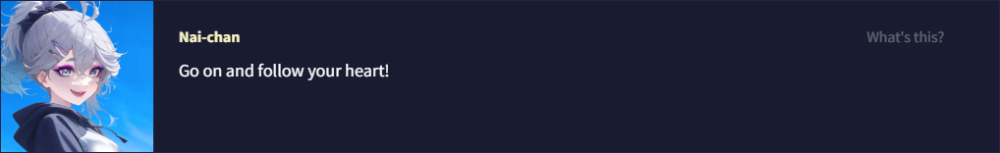

# Theme
*Last contents updated 9/24/2024*



NovelAI에는 19가지의 기본 테마 옵션과 원하는 대로 사이트를 커스터마이징할 수 있는 직관적인 인터페이스가 포함되어 있습니다! **Theme Editor**를 사용하여 배경과 텍스트 색상, 제목이나 문단에 사용되는 글자의 폰트를 바꿔보세요.



색상을 변경하면 **Theme Editor**에서 배경색이 변경되어 변경점을 미리 볼 수 있습니다. 각 요소 옆의 **Color Picker**를 사용하여 원하는 모든 색상을 자세하게 조장할 수 있습니다.



테마를 변경한 후에는 반드시 적용하고 저장하세요. 테마는 다른 장치나 계정에 쉽게 공유하고 가져올 수 있도록 `.naitheme` 파일로 내보내집니다. Anlatan Discord의 **novelai-content-sharing** 채널에는 수십 개의 사용자 테마가 포함된 테마 섹션이 있습니다.



**Custom CSS** 드롭다운을 사용하여 NovelAI 테마를 추가적으로 커스터마이징할 수 있습니다. 이것은 고급기능이며 향후 업데이트로 인해 코드가 정상 작동하지 않을 수 있거나 UI가 깨질 수 있다는 점을 유의하세요. 고지한 것처럼 이런 상황이 일어난다면 `Alt+Shift+P` 단축키를 눌러 기본 테마로 리셋할 수 있습니다.

## Custom Hypebot

```
.comment-avatar-box {
    background-image: url(https://i.imgur.com/fPwZIbN.jpg);
}
.comment-avatar {
    background-image: url(https://i.imgur.com/hvb1a4i.png) !important;
    background-color: transparent !important;
}
.comment-arrow {
    opacity: 0.0 !important;
}
```

`.comment-avatar-box` 클래스는 HypeBot 배경 이미지를 변경하고, `.comment-avatar` 클래스는 아이들 상태일 때 표시되는 기본 HypeBot 아바타를 변경합니다. 움직이는 `.gif`는 모든 HypeBot 이미지 링크에서 지원됩니다. 배경 이미지가 작동하기 위해서는 투명도에 대한 코드가 필요합니다. **urls**을 사용하고자하는 이미지로 바꾸세요.

`.comment-arrow` 클래스는 말풍선 화살표를 표시하는 방법을 결정합니다. 위 코드를 복사하면 말풍선 화살표가 제거될 겁니다.

```
.comment-avatar-speaking-active {
    background-image: url(https://i.imgur.com/FqSGMHE.gif) !important;
}
```

`.comment-avatar-speaking-active` 클래스는 response 텍스트가 스트리밍되는 동안 표시되는 HypeBot 이미지를 변경합니다. 이를 사용하여 커스텀 아바타에 대한 움직이는 프레임이나 애니메이션을 만드세요!

```
.comment-avatar-thinking {
    background-image: url(https://i.imgur.com/CrCTvlu.png) !important;
}
```

`.comment-avatar-thinking` 클래스는 텍스트 스트리밍이 시작되기 전의 짧은 순간 혹은 재생성하기 위해 아바타를 클릭할 때 '생각'하는 동안 표시되는 HypeBot의 이미지를 변경합니다.

```
.comment-avatar-idle {
    background-image: url(https://i.imgur.com/hvb1a4i.png) !important;
}
```

`.comment-avatar-idle` 클래스는 텍스트 스트리밍이 완료된 후에 나타나는 아이들 프레임을 변경합니다. 이 이미지는 일반적으로 `.comment-avatar` 클래스에서 사용하는 것과 동일할 수 있습니다.

```
.comment-name::after {
    content: 'Nai-chan' !important;
}
```

`.comment-name::after` 클래스는 HypeBot의 이름을 변경합니다.

위의 모든 항목을 합치면, Custom CSS 드롭다운은 다음과 같을 것이다.

```
.comment-avatar-box {
    background-image: url(https://i.imgur.com/fPwZIbN.jpg);
}
.comment-avatar {
    background-image: url(https://i.imgur.com/hvb1a4i.png) !important;
    background-color: transparent !important;
}
.comment-arrow{
    opacity: 0.0 !important;
}
.comment-avatar-speaking-active {
    background-image: url(https://i.imgur.com/FqSGMHE.gif) !important;
}
.comment-avatar-thinking {
    background-image: url(https://i.imgur.com/CrCTvlu.png) !important;
}
.comment-avatar-idle{
    background-image: url(https://i.imgur.com/hvb1a4i.png) !important;
}
.comment-name::after {
    content: 'Nai-chan' !important;
}

```

<table style="border: 1px solid">
<tr>
<td>

</td>
<td>

</td>
<td>

</td>
</tr>
</table>



## Background Image

```
#app {
    background-image: url(https://i.imgur.com/2Xt07Ut.jpg);
    background-size: cover;
    background-position: center;
}
```

위 코드는 에디터의 배경 이미지를 사용자가 좋아하는 것으로 바꿀 수 있습니다.


## Transparent Background

```
.menubar, .infobar, .conversation, .module-trainer {
    background-color: #0c0c1088 !important;
    backdrop-filter: blur(5px);
}
```

위 코드를 사용하면 에디터를 투명하고 약간 흐리게 만들어 배경 이미지를 더 많이 보이게 할 수 있습니다. `backdrop-filter` 값을 변경하여 블러 정도를 변경할 수 있습니다.


## Borders

```
* {
    border: none !important;
    outline: none !important;
}
```

위 코드는 여러 박스와 사이드바의 경계선을 제거한다. 애스터리스크를 잊지마세요! 이게 없으면 작동하지 않습니다!